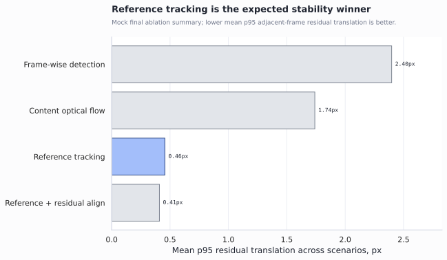
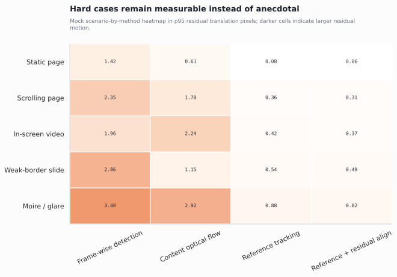
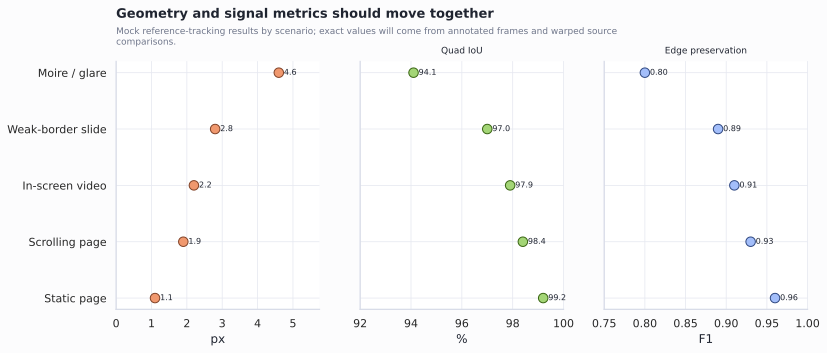
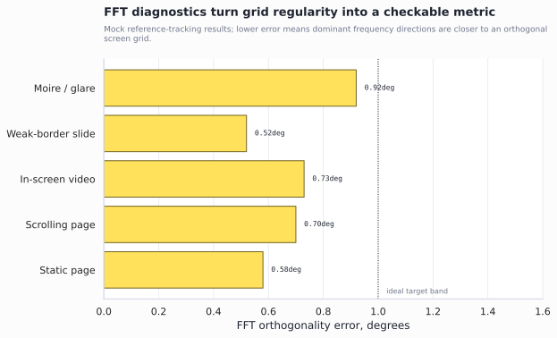
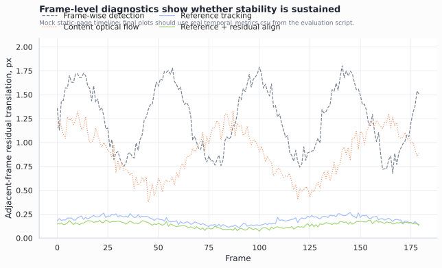

# MOCK PLANNING DRAFT, NOT EXPERIMENTAL RESULTS: Screen Capture Rectification and Temporal Stabilization for Real-World Captured-Screen Videos

> **Academic integrity note.** This document is a mock planning manuscript prepared for instructor feedback on project scope, structure, figures, and evaluation design. The numerical values and result figures in this draft are simulated placeholders from `mock_figures/mock_final_metrics.csv` and `mock_figures/mock_temporal_metrics.csv`. They must not be presented as measured experimental results. The final report will replace all mock values with metrics computed from real videos and manual corner annotations.

## Purpose of This Mock Draft

This draft asks whether the proposed project direction is worth pursuing as a final project before the full video dataset and annotations are completed. It uses mock idealized results to show the intended manuscript structure, planned figures, and evaluation logic. The technical question for feedback is whether a geometry-first preprocessing pipeline for filmed screen videos is a sufficiently focused and defensible image-processing project.

**One-sentence argument.** Real captured-screen videos need a geometric front end before screen restoration: this project proposes a classical pipeline that detects, rectifies, tracks, and stabilizes the screen plane, and it evaluates the pipeline with geometry, temporal stability, signal preservation, and frequency-domain diagnostics.

**Questions for the instructor.**

1. Is this front-end screen rectification and stabilization task sufficiently distinct from downstream screen demoireing or generic video stabilization?
2. Are the proposed baselines and metrics enough for a course final project if the final data are self-collected videos with manually annotated key frames?
3. Should the final implementation prioritize a border-guided tracker, as written in the proposal, or is the current reference-plane tracking pipeline acceptable if the report explains the design change clearly?

## Abstract

Camera-captured screen videos are often geometrically unprepared for downstream restoration, optical character recognition, or archiving. A handheld phone video of a monitor usually contains background regions, perspective distortion, frame-to-frame shake, weak screen borders, glare, moire patterns, and moving content inside the screen. Existing screen restoration and video demoireing studies commonly focus on already cropped, controlled, or aligned screen content, leaving an application-level preprocessing step under-specified. This mock planning manuscript proposes a classical image-processing pipeline for that missing front end. The pipeline initializes the screen quadrilateral, estimates a homography to a fixed screen canvas, tracks the screen plane over time, rejects unreliable updates with geometric gates, interpolates missing observations, smooths the corner trajectory, and optionally applies residual alignment after rectification. The final evaluation will compare frame-wise detection, content-based optical flow, reference-plane tracking, and residual alignment on self-collected captured-screen videos. Metrics will include annotated corner error, quadrilateral IoU, aspect-ratio error, adjacent-frame residual motion, edge preservation, gradient preservation, and FFT-based grid regularity. Mock figures in this draft illustrate the intended result pattern only: reference-plane tracking is expected to reduce residual motion while maintaining screen-coordinate detail, with moire-heavy and weak-border scenes defining the failure boundary.

## 1. Introduction

Filming a computer screen with a mobile phone is common when direct screen recording is unavailable. Users may record online lectures, debugging sessions, dashboards, chat windows, presentations, or video playback. The captured video, however, is not a clean screen recording. It includes the surrounding scene, perspective tilt, handheld camera motion, reflections, moire artifacts, and moving content inside the display.

This project studies the geometric preprocessing step that occurs before image restoration. The target input is a real handheld video of a physical monitor. The target output is a fixed-resolution screen-coordinate video that removes most off-screen background, corrects perspective distortion, and reduces frame-to-frame jitter while preserving real on-screen motion.

The project is motivated by the gap between controlled screen restoration datasets and real user capture. Screen demoireing methods demonstrate that recaptured displays are a real restoration problem, but many such pipelines assume a cropped or aligned screen-content input. In practice, the first module in an application pipeline must locate the screen, rectify it, and stabilize the screen plane before any restoration model can operate reliably.

The proposed contribution is therefore not a complete screen restoration system. It is a geometry-first front end for a larger captured-screen restoration chain:

```text
raw filmed screen video
  -> screen localization
  -> perspective rectification
  -> screen-plane tracking
  -> temporal stabilization
  -> screen-coordinate video
  -> downstream demoireing, OCR, archiving, or human inspection
```

This scope keeps the project within classical digital image processing and geometric vision. The core technical challenge is to estimate the physical screen plane over time without allowing scrolling text, video playback, cursor motion, or subtitles to pull the homography away from the true screen coordinate system.

## 2. Related Work

Planar rectification provides the geometric basis for the project. A display or document can often be approximated as a plane, so the mapping between the camera image and the screen surface can be modeled by a homography. Work on screen-to-camera homography estimation, mobile document rectification, and whiteboard scanning supports the idea that screen or document boundaries can be used to recover a frontal view.

Feature tracking and robust estimation provide the temporal basis. Lucas-Kanade tracking and good-feature selection are standard tools for propagating local points across frames. Robust estimators such as RANSAC or related variants are needed because moving screen content, glare, and moire can produce outliers. In this project, tracked points are useful only if they agree with a stable screen-plane motion.

Video stabilization provides the trajectory-level basis. Stabilization methods estimate a frame-to-frame or global camera motion trajectory and suppress high-frequency motion. Homography-based stabilization is particularly relevant because the screen is a planar object. This project uses a simpler and more interpretable version of that idea: estimate a corner trajectory, reject bad updates, interpolate missing frames, and smooth the trajectory before warping frames to a fixed canvas.

Screen demoireing and captured-screen restoration provide the application context. These methods address the quality degradation of screen content after camera capture. However, their benchmarks often rely on controlled acquisition, cropped screen content, or aligned input-output pairs. The present project targets the earlier real-world step, where the input is still a full camera video containing background, screen borders, perspective distortion, and handheld motion.

## 3. Task Definition

The input is a short video of a computer screen captured by a phone or camera. The screen may be tilted, partially surrounded by background, and affected by mild camera shake. The screen content may be static, scrolling, or playing video.

The output is a normalized screen video with a fixed aspect ratio and resolution. The default target canvas is `1920 x 1080`. The output should:

- remove most off-screen background;
- map the screen plane to a frontal rectangular coordinate system;
- stabilize screen-fixed structures such as borders, browser chrome, and page layout;
- preserve real screen content changes such as scrolling, playback, cursor motion, and subtitles;
- expose failure cases where screen borders, texture, or tracking evidence are insufficient.

The project does not attempt to remove moire, correct color, super-resolve text, or restore saturated glare regions. Those tasks belong to downstream restoration.

## 4. Method

### 4.1 Pipeline Overview

The planned system has five stages. First, the screen quadrilateral is initialized by automatic detection or manual corner input. Second, each frame is warped by a homography to a fixed screen canvas. Third, the screen plane is tracked over time with feature tracking and robust homography estimation. Fourth, unreliable corner observations are rejected, interpolated, and smoothed. Fifth, an optional residual alignment stage corrects small remaining affine motion after rectification when the whole-video accept ratio is reliable.

This design separates screen-plane motion from screen-content motion. Screen-plane motion is the physical camera-screen geometry that should be stabilized. Screen-content motion is the webpage, video, cursor, or subtitle motion that should remain in the normalized output.

### 4.2 Screen Initialization

The first frame provides the initial screen quadrilateral. If automatic detection is reliable, the system selects a large plausible quadrilateral based on area, aspect ratio, and geometric validity. If automatic detection fails, the user can provide four corners in top-left, top-right, bottom-right, bottom-left order.

Manual initialization is not a weakness for the project scope. The proposal asks whether a real captured-screen video can be geometrically normalized and stabilized. A manual first-frame fallback keeps the focus on the temporal tracking and evaluation problem instead of making the project depend entirely on fully automatic screen detection.

### 4.3 Homography Rectification

For each frame, the estimated screen quadrilateral defines a homography from camera coordinates to the target rectangular canvas. Warping by this homography removes the camera perspective and maps the screen content to a stable coordinate system. This step also removes most background because only the screen quadrilateral is sampled into the output canvas.

### 4.4 Reference-Plane Tracking

The main tracker uses the first screen plane as a reference. Feature points are selected inside the screen region and tracked with Lucas-Kanade optical flow. A homography is estimated between reference points and current-frame points with a robust estimator. The update is accepted only when it passes constraints on inlier count, inlier ratio, reprojection error, spatial coverage, side-length change, and area change.

This reference-plane design is intended to be safer than frame-wise detection or plain optical flow. Frame-wise detection can jitter because independent corner estimates vary from frame to frame. Plain optical flow can drift when page scrolling or video playback produces many moving features. A reference tracker keeps each frame tied to a common screen plane and rejects updates that do not have enough stable support.

### 4.5 Trajectory Repair and Smoothing

Rejected observations are not trusted directly. The corner trajectory is repaired by interpolation between reliable frames when possible. The trajectory is then smoothed with a temporal filter. This step treats sudden corner jumps as estimation noise and preserves slower screen-plane motion caused by handheld camera movement.

### 4.6 Optional Residual Alignment

After homography rectification, the normalized video may still contain small residual affine motion. The optional residual alignment stage estimates a frame-to-reference affine correction. This stage is applied only when enough frames pass reliability checks. Otherwise it is disabled to avoid stabilizing moving screen content instead of camera motion.

## 5. Planned Evaluation

### 5.1 Dataset Plan

The final dataset will use self-collected real captured-screen videos. The proposal target is five scenario classes with ten clips per class, about five seconds per clip. For the first experimental pass, a smaller set of representative videos is sufficient:

| Scenario class | Purpose |
| --- | --- |
| Static page | Clean success case with stable screen content |
| Scrolling page | Tests whether content motion pulls the tracker |
| In-screen video playback | Tests large internal motion inside the screen |
| Weak-border slide or white page | Tests low texture and weak boundary evidence |
| Moire / glare hard case | Tests failure boundary under degraded texture |

Selected key frames from each video will be manually annotated with four screen corners. The annotation file will use:

```text
frame,tl_x,tl_y,tr_x,tr_y,br_x,br_y,bl_x,bl_y
```

The final report should not require every frame to be annotated. A small set of key frames can measure geometric accuracy, while the full video can measure temporal stability.

### 5.2 Baselines and Ablations

The planned comparison includes four methods:

1. **Frame-wise detection.** Estimate the screen quadrilateral independently per frame.
2. **Content optical flow.** Propagate corners frame to frame using optical flow.
3. **Reference tracking.** Track the screen plane relative to the first frame with robust homography estimation and geometric gates.
4. **Reference tracking plus residual alignment.** Add guarded post-rectification affine stabilization.

The comparison is designed to isolate the main claim. If reference tracking improves stability over frame-wise detection and plain flow, then the project has evidence that reference-plane estimation is useful for captured-screen videos.

### 5.3 Metrics

The final evaluation has four dimensions:

| Dimension | Metric | Required input |
| --- | --- | --- |
| Geometry accuracy | Corner RMSE, quadrilateral IoU, aspect-ratio error | Manual key-frame corners and estimated corners |
| Temporal stability | Adjacent-frame residual translation, rotation, and scale p95 | Normalized output video |
| Signal preservation | Mean gradient magnitude and edge preservation index | Original video, manual corners, normalized video |
| Frequency regularity | FFT dominant-direction orthogonality error | Normalized video |

These metrics are complementary. Geometry metrics verify whether the estimated screen plane matches human annotations. Stability metrics show whether screen-fixed structures stop jittering. Signal metrics check whether rectification preserves useful detail. Frequency diagnostics test whether regular screen-grid structure becomes closer to an orthogonal screen coordinate system.

## 6. Mock Result Figures

All figures in this section are simulated placeholders. They show the intended style and claim structure for the final paper. They should be replaced with real metrics before submission.

### Figure 1. Mock method ablation summary



**Figure 1 | Mock method ablation summary.** The planned main comparison is mean p95 residual translation across scenario classes. The expected result pattern is that reference-plane tracking reduces residual motion compared with frame-wise detection and content optical flow. This figure uses mock data only.

### Figure 2. Mock robustness heatmap across scenarios



**Figure 2 | Mock scenario-by-method robustness heatmap.** The planned heatmap reports p95 residual translation for each method and scenario. It is intended to make hard cases visible rather than anecdotal. This figure uses mock data only.

### Figure 3. Mock geometry and signal preservation panel



**Figure 3 | Mock geometry and signal preservation panel.** The planned final report should not rely on stability alone. Geometry and signal metrics show whether the normalized output remains faithful to manually annotated screen coordinates. This figure uses mock data only.

### Figure 4. Mock FFT regularity diagnostic



**Figure 4 | Mock FFT regularity diagnostic.** For moire or regular-grid cases, the final report can use FFT dominant-direction analysis as a diagnostic rather than as a restoration score. Lower orthogonality error means dominant frequency directions are closer to an orthogonal screen grid. This figure uses mock data only.

### Figure 5. Mock frame-level stability timeline



**Figure 5 | Mock frame-level residual motion timeline.** A frame-level plot is useful for detecting whether a method is stable throughout the clip or fails in a short interval. The final version should be generated from `temporal_metrics.csv`. This figure uses mock data only.

## 7. Mock Expected Results

The mock data assume that reference-plane tracking will be the strongest main method. In the simulated table, reference tracking reduces residual translation on static and dynamic scenarios while preserving high quadrilateral IoU and edge preservation. The mock data also assume that weak-border and moire scenes remain more difficult than static pages.

This result pattern would support three final claims if real data follow the same trend:

1. Reference-plane tracking is more stable than independent frame-wise detection.
2. Content optical flow is unreliable when screen-internal motion is large.
3. Weak borders, glare, and moire define a meaningful failure boundary for the current classical pipeline.

The final paper should not overstate these claims. If real data show that residual alignment does not consistently improve results, that should be reported as a negative or conditional result rather than hidden.

## 8. Discussion

The main value of the project is its application framing. A real user video of a monitor is not the same input assumed by many restoration pipelines. The camera sees a physical scene first. The system must therefore solve screen localization, perspective normalization, and temporal stabilization before restoration can be evaluated fairly.

The method is intentionally classical and interpretable. Each step produces inspectable evidence: corner estimates, inlier counts, reprojection error, coverage, rejection reasons, and residual motion metrics. This makes the project suitable for a digital image processing course, because the final report can explain why a frame was accepted or rejected rather than relying on a black-box model.

The largest risk is the gap between the proposal wording and the current implementation. The proposal describes border-guided tracking with LSD or Hough line detection as the main homography cue. The current implementation is closer to reference-plane tracking with LK features, RANSAC, and geometry gates. There are two defensible paths:

- **Implementation path A:** add a border-guided module and use it as a correction or fallback when borders are visible.
- **Implementation path B:** keep reference-plane tracking as the main method and explain that the proposal converged to a more reliable reference-tracking implementation, while line evidence remains an optional diagnostic.

For a course project, path B may be safer if time is limited. It keeps the evaluation honest and avoids adding a weak line module only to match the proposal text. Path A is stronger if the instructor expects the final work to follow the submitted proposal closely.

## 9. Limitations and Required Next Evidence

This mock draft is not evidence. The following work is required before the final report:

1. Collect or confirm the final video set.
2. Annotate selected key frames with four screen corners.
3. Run all baselines with fixed commands and run names.
4. Generate `evaluation_summary.csv`, `temporal_metrics.csv`, `geometry_metrics.csv`, `signal_metrics.csv`, and `spectral_metrics.csv`.
5. Replace every mock figure and mock number in this draft with real output.
6. Add qualitative before-and-after frame strips from representative videos.
7. Report at least one failure case, preferably weak borders, glare, or moire.

## 10. Conclusion

This mock planning draft proposes a focused project: converting real captured-screen videos into rectified and temporally stabilized screen-coordinate videos. The project is worth pursuing if the instructor agrees that this preprocessing step is a valid and distinct problem from both generic video stabilization and downstream screen demoireing.

The final deliverable should be judged by whether the pipeline can produce stable screen-coordinate videos on representative real captures and by whether the evaluation separates screen-plane motion from screen-content motion. The most important next step is not language polishing. It is collecting videos, annotating key frames, running the planned baselines, and replacing the mock results with measured evidence.

## References to Verify Before Final Submission

These references are included as a planning list. Full citation formatting and source verification are still required before final submission.

1. Okatani and Deguchi, *Screen-to-Camera Homography Estimation*, ICCV 2003.
2. Zhang and He, *Whiteboard Scanning and Image Enhancement*, 2007.
3. Lu and Tan, *Perspective Rectification for Mobile Phone Camera-Based Documents Using a Hybrid Approach to Vanishing Point Detection*, CBDAR 2007.
4. Lucas and Kanade, *An Iterative Image Registration Technique with an Application to Stereo Vision*, 1981.
5. Shi and Tomasi, *Good Features to Track*, CVPR 1994.
6. Bouguet, *Pyramidal Implementation of the Lucas Kanade Feature Tracker*.
7. Torr and Zisserman, *MLESAC: A New Robust Estimator with Application to Estimating Image Geometry*, 2000.
8. Grompone von Gioi et al., *LSD: a Line Segment Detector*, IPOL 2012.
9. Sanchez and Morel, *Motion Smoothing Strategies for Video Stabilization*, IPOL 2017.
10. Grundmann et al., *Auto-Directed Video Stabilization with Robust L1 Optimal Camera Paths*, CVPR 2011.
11. Bradley et al., *Cinematic-L1 Video Stabilization with a Log-Homography Model*, WACV 2021.
12. Video demoireing and captured-screen restoration papers listed in `doc/application-pipeline-story.md`.

## Claim-Evidence Map for Instructor Review

| Claim | Evidence status in this mock draft | Final evidence needed |
| --- | --- | --- |
| Real captured-screen videos need geometry preprocessing before restoration. | Supported by problem framing and related-work rationale. | Short qualitative examples from raw videos. |
| Reference-plane tracking should reduce jitter versus frame-wise detection. | Mock data only. | Real ablation metrics across videos. |
| Content optical flow can drift under scrolling or video playback. | Plausible design rationale, mock data only. | Real comparison on scrolling and playback clips. |
| Geometry, stability, signal, and FFT metrics cover complementary failure modes. | Evaluation framework implemented, mock data only. | Real CSV outputs from annotated and unannotated videos. |
| Moire and weak borders are likely failure cases. | Plausible from task analysis, mock data only. | Real failure-case clips and debug logs. |
