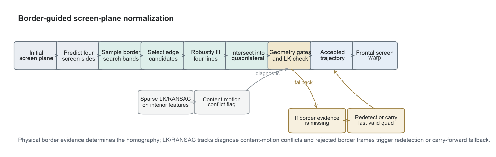
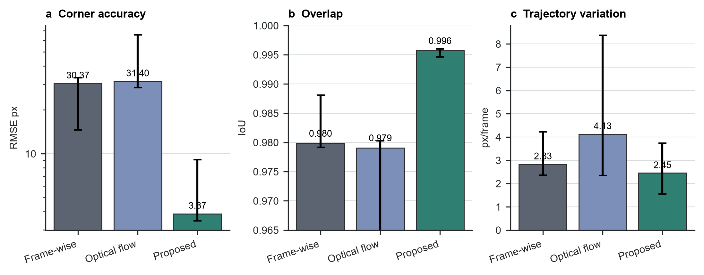
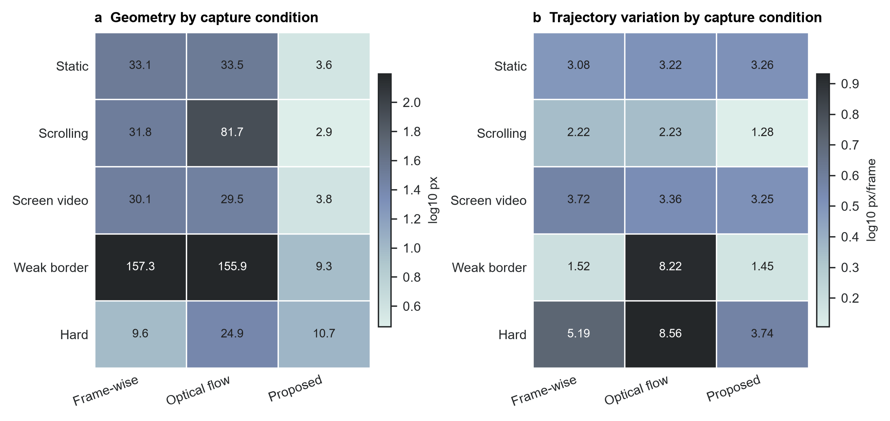
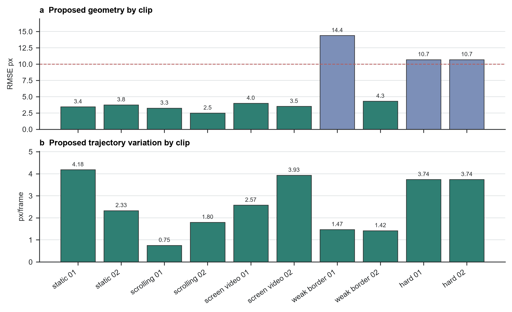
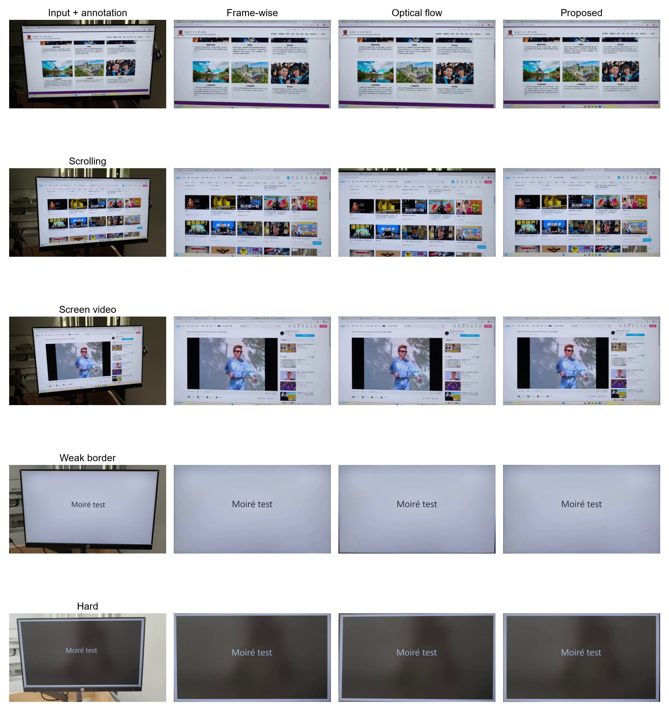
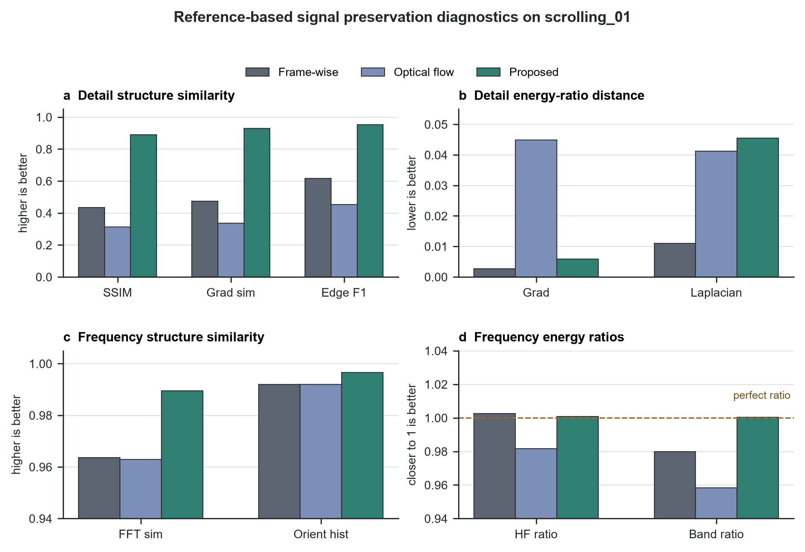

# 摘要

拍屏视频可以在无法直接录屏时保留屏幕内容，但相机视角同时包含透视畸变、手持抖动、背景干扰、弱显示器边框，以及屏幕内部独立滚动或播放的内容。本文研究这类视频的几何屏幕平面归一化问题。我们提出一种边框主导的方法：以物理屏幕边界作为单应矩阵的主要证据，先预测边框搜索带，从局部图像证据恢复四条屏幕边线，再由边线交点形成四边形，并结合几何合理性与 LK/RANSAC 一致性检查，最后将每帧渲染到正面屏幕画布。在覆盖五类拍摄条件的十个标注片段上，该方法达到 3.87 px 的角点 RMSE 中位数、0.996 的四边形 IoU 中位数，以及 2.45 px/frame 的帧间平移变化中位数。结果表明，以物理边框作为主线索可以避免内容驱动跟踪的主要失败模式，尤其适用于滚动页面和弱边框场景。

**关键词：** 屏幕矫正；拍屏视频；单应矩阵；边框检测；光流；视频稳定

# 1. 引言

拍屏视频是课堂、演示、会议和设备输出记录中的实用替代方案。与干净录屏不同，手持相机视频包含透视畸变、相机抖动、曝光变化、眩光、背景区域，以及显示器边框的局部缺失。要让后续阅读、识别或恢复更可靠，首先需要估计并归一化物理显示屏平面。

核心困难在于，显示内容和物理屏幕不服从同一个运动模型。文本、网页和视频可以在屏幕内部运动，而显示器本身的运动只来自相机。跟踪器如果跟随内部内容，就可能得到稳定但错误的屏幕平面；逐帧独立检测虽然能避开一部分内容漂移，却可能引入抖动，也可能在弱边框下失败。

本文方法把物理边框而不是屏幕内部纹理作为屏幕平面估计的主要证据。从初始四角标注或检测结果出发，每一帧都在预测的屏幕边附近搜索边界，拟合四条边线，并由交点构造当前四边形。系统仍计算稀疏 LK/RANSAC 跟踪，但其作用是诊断内部内容运动与边框估计是否冲突，而不是在有效边界证据存在时替代边框主导的单应矩阵。

本文贡献有三点。第一，给出一条面向拍屏视频的几何归一化流程，其中屏幕边界证据主导屏幕平面轨迹。第二，定义基于四角标注、几何指标和轨迹指标的可复现实验评估，并覆盖五类拍摄条件。第三，实验表明边框主导方法在提升标注几何精度的同时保持较好的时间稳定性，其中滚动页面和弱边框片段收益最大。

# 2. 相关工作

平面文档和屏幕矫正依赖相机与平面之间的投影关系。相机文档分析常利用页面边界、版面线索和投影几何恢复正面文档视图 [1-3]。屏幕-相机标定同样把显示屏建模为平面单应矩阵，但受控标定图案提供了普通手持视频中没有的强证据 [4]。拍屏视频归一化继承了平面几何模型，但必须从非受控视频帧中估计。

稀疏特征跟踪和鲁棒模型拟合是视频几何中的常用工具。Lucas-Kanade 配准及其金字塔实现支持中等运动下的局部特征跟踪 [5,6]，Shi-Tomasi 特征提供可跟踪点 [7]，RANSAC 风格估计器用于处理错误对应 [8]。这些工具适合做一致性检查，但当屏幕内部内容运动时，最强的内部特征可能与物理显示屏边界不一致。

视频稳定研究强调，平滑的相机路径和正确的几何不是同一个目标 [9,10]。拍屏视频归一化同样需要区分二者：矫正结果平滑，并不代表四边形仍然贴合显示器。拍屏恢复和视频去摩尔纹方法通常在屏幕区域已经可用之后工作 [11-13]；本文处理的是它们之前的几何前端。

# 3. 方法

## 3.1 任务与表示

输入是包含一个可见显示屏的手持视频，输出是变换到固定正面屏幕画布的视频。每帧屏幕由四边形表示，角点顺序为左上、右上、右下、左下。第一帧优先使用人工四角标注初始化，缺失时使用自动检测回退。由于第 0 帧提供初始化证据，它不参与几何误差评分。

## 3.2 边框主导的屏幕估计

提出的方法从物理屏幕边界估计每一帧的屏幕四边形（图 1）。上一帧已接受四边形给出四条屏幕边的大致位置。方法在每条边附近沿屏幕内法线采样图像剖面，选择靠近预测边的高梯度边界候选点。每条边的候选点被鲁棒拟合成直线，相邻直线的交点形成当前四边形。

这种设计改变了光流的角色。内部特征不再决定屏幕单应矩阵；系统只把 LK/RANSAC 运动作为一致性信号。如果内部轨迹与边框四边形不一致，该帧被标记为内容运动冲突。只要边界估计有效，方法仍使用边框四边形，因为这种不一致正是滚动页面或屏幕内视频播放时的预期现象。

## 3.3 门控、回退与渲染

只有当四条边都有可用线证据，且生成的四边形有效、凸、并且相对上一屏幕平面变化合理时，方法才接受边框候选。如果边界证据缺失，系统尝试自动重新检测；若边框拟合和重新检测都失败，则该帧沿用上一帧已接受四边形。最终轨迹在需要时做插值、平滑，并被用于生成固定尺寸的正面屏幕输出。

## 3.4 对比方法

所有方法使用相同输入视频、初始化、输出画布、标注、编码器和指标代码。第一种对比方法在每一帧独立估计屏幕；第二种方法用相邻帧光流传播上一帧四边形；提出的方法使用边框主导四边形估计、几何门控、回退处理、轨迹平滑，以及 LK/RANSAC 一致性诊断。

# 4. 数据集与评估

## 4.1 数据与标注

项目数据集包含 50 个拍屏视频，共 14,985 帧，覆盖五种拍摄条件：静态页面、滚动页面、屏幕内播放视频、弱边框场景，以及视角或背景困难的挑战场景。最终定量评估使用十个带标注片段，每种条件两个片段。

| 拍摄条件 | 数据集片段数 | 评估片段数 |
|---|---:|---:|
| 静态页面 | 10 | 2 |
| 滚动页面 | 10 | 2 |
| 屏幕内播放视频 | 10 | 2 |
| 弱边框场景 | 10 | 2 |
| 挑战场景 | 10 | 2 |
| 合计 | 50 | 10 |

人工标注记录可见屏幕四角。几何精度在非初始化标注帧上评估。指标先在每个片段内取中位数，再跨片段报告中位数和四分位区间。

## 4.2 指标

几何精度由角点均方根误差（RMSE）、四边形交并比（IoU）和宽高比误差衡量。时间稳定性由估计屏幕四边形的相邻帧投影变化计算，并总结为平移、旋转和尺度变化。正文主要报告角点 RMSE、IoU 和平移变化，因为它们直接检验方法是否同时满足几何准确和轨迹稳定。

我们还在带标注帧上计算 reference-based 信号保留诊断。具体做法是用人工四角标注把原始拍屏帧 warp 成 reference，再将各方法的 normalized output 与该 reference 在局部细节和频域上比较。这类诊断检查几何归一化后是否保留原始拍屏信号，包括已经存在的高频相机-屏幕干涉结构；它不衡量去摩尔纹，也不作为主排名指标。

# 5. 结果

## 5.1 总体对比

边框主导方法取得了最好的总体几何精度，同时也降低了轨迹变化（图 2、表 2）。其角点 RMSE 中位数为 3.87 px，低于逐帧检测的 30.37 px 和相邻帧光流的 31.40 px。该方法还取得最高的 IoU 中位数 0.996，以及最低的平移变化中位数 2.45 px/frame。

| 指标 | 逐帧检测 | 相邻帧光流 | Proposed |
|---|---:|---:|---:|
| 角点 RMSE，px ↓ | 30.37 [14.59, 33.22] | 31.40 [28.37, 65.52] | 3.87 [3.47, 9.10] |
| 四边形 IoU ↑ | 0.980 [0.979, 0.988] | 0.979 [0.932, 0.980] | 0.996 [0.995, 0.996] |
| 平移变化，px/frame ↓ | 2.83 [2.37, 4.22] | 4.13 [2.35, 8.37] | 2.45 [1.55, 3.74] |

这一结果支持本文的核心设计选择。当单应矩阵由屏幕边框而不是内部内容主导时，估计平面更贴近标注的物理显示屏，同时避免了相邻帧跟踪中的内容漂移。

## 5.2 分类结果

最大提升出现在内容运动强或边界较弱的场景中（图 3、表 3）。在滚动页面上，Proposed 的 RMSE 中位数为 2.87 px，而逐帧检测为 31.76 px，相邻帧光流为 81.67 px。在弱边框片段上，Proposed 将 RMSE 中位数降至 9.35 px，而另外两种方法均超过 155 px。

| 拍摄条件 | 逐帧 RMSE | 光流 RMSE | Proposed RMSE | Proposed 平移变化 |
|---|---:|---:|---:|---:|
| 静态页面 | 33.13 | 33.49 | 3.60 | 3.26 |
| 滚动页面 | 31.76 | 81.67 | 2.87 | 1.28 |
| 屏幕内播放视频 | 30.08 | 29.46 | 3.75 | 3.25 |
| 弱边框场景 | 157.26 | 155.87 | 9.35 | 1.45 |
| 挑战场景 | 9.62 | 24.90 | 10.70 | 3.74 |

挑战场景是唯一逐帧检测 RMSE 略低于 Proposed 的类别。两者绝对差距较小，而 Proposed 在该类别的轨迹更稳定：平移变化为 3.74 px/frame，低于逐帧检测的 5.19 px/frame 和相邻帧光流的 8.56 px/frame。

## 5.3 片段级表现

Proposed 在十个评估片段上表现稳定（图 4）。其中七个片段的 RMSE 中位数低于 5 px，所有片段都低于 15 px。误差较高的片段是一段弱边框视频和两个挑战视频，它们的可见边界更弱。在同一次运行中，方法没有冻结任何帧：每一帧都来自边框证据或有效回退，而不是依靠长期保持上一四边形获得稳定性。

这说明当前结果并不是保守门控拒绝更新后得到的表面稳定。物理边框移动时，轨迹会随之更新；LK/RANSAC 不一致主要记录内部内容运动与边界估计之间的冲突。

## 5.4 Proposed 方法消融

在代表性滚动片段上，我们对当前 Proposed 链路新增的模块做定向消融（表 4）。正文总体实验中的 baseline 不变；这里复用其中两个结果，只作为“无物理边框线索”的诊断项。去掉物理屏幕边界后，相邻帧光流的 RMSE 为 76.114 px，reference-plane LK/RANSAC 跟踪器的 RMSE 为 643.949 px。相同片段上，完整边框主导方法的 RMSE 为 3.253 px，IoU 为 0.996038。

| 变体 | 检查内容 | 角点 RMSE，px ↓ | IoU ↑ | 平移变化，px/frame ↓ |
|---|---|---:|---:|---:|
| 相邻帧光流 | 无物理边框线索 | 76.114 | 0.916022 | 2.205 |
| Reference-plane LK/RANSAC | 无物理边框线索 | 643.949 | 0.520994 | 4.579 |
| Proposed，profile 边框 | 完整方法 | 3.253 | 0.996038 | 0.752 |
| 去掉轨迹滤波 | 移除轨迹平滑 | 2.932 | 0.996585 | 1.430 |
| 去掉 LK 一致性诊断 | 关闭内部运动检查 | 3.253 | 0.996038 | 0.752 |
| 去掉重新检测回退 | 关闭自动回退 | 3.253 | 0.996038 | 0.752 |
| 放宽边缘门控 | 放宽边缘合理性约束 | 3.253 | 0.996038 | 0.752 |
| LSD 边框观测 | 替换 profile 边缘观测 | 3.604 | 0.995716 | 0.961 |
| Hough 边框观测 | 替换 profile 边缘观测 | 27.335 | 0.974200 | 0.897 |

这个消融说明，物理边框线索是决定性模块；没有它，连贯的滚动内容会主导单应矩阵。去掉轨迹平滑在这个片段的稀疏标注帧上 RMSE 略低，但帧间平移变化接近翻倍，因此主方法保留该滤波以换取时间稳定性。LK 诊断、重新检测回退和放宽门控在这个片段上没有改变结果，是因为 profile 边框证据每一帧都成功；这些行说明当前结果不是靠冻结或回退得到的。LSD 和 Hough 属于同一组边框观测方式消融：LSD 几何接近但更慢，Hough 误差明显更大，因此主方法使用 profile 观测。

## 5.5 定性对比

定性输出与定量结果一致（图 5）。在滚动和弱边框样例中，Proposed 更好地保留了屏幕范围，而内容驱动跟踪或逐帧检测可能产生裁切偏移。在静态页面和屏幕内视频样例中，三种方法都能生成可读结果，但 Proposed 的物理边框对齐更稳定。

## 5.6 信号保留诊断

代表性滚动片段上的 reference-based 信号诊断支持定性观察，但不改变主指标层级（图 6）。以人工标注 warp 得到的原始帧 reference 为比较对象，Proposed 的局部结构相似度高于两个对比方法：SSIM 为 0.890，梯度图相似度为 0.930，边缘 F1 为 0.952。频域诊断也呈现相同趋势，Proposed 的 log-FFT 幅值相似度和方向直方图相似度更高，同时高频能量比和宽频带能量比接近 1。

# 6. 讨论

实验说明，拍屏视频归一化应优先依赖物理屏幕证据，而不是内部内容运动。边框主导方法有效，是因为它在估计逻辑中分离了屏幕边界和显示内容：边界线决定单应矩阵，LK/RANSAC 轨迹用于诊断内部纹理是否在做不同运动。这种分离在滚动页面中尤其关键，因为滚动内容的运动很强、也很一致，但它不是屏幕运动。

该方法仍依赖可见边界证据。很暗的边框、反光、遮挡，或与背景几乎没有对比度的显示屏，都会削弱边线拟合。当前标注也是稀疏关键帧，而不是逐帧密集真值，因此时间指标应被理解为轨迹诊断，而不是独立的物理运动真值。后续最直接的改进方向是更强的边界模型和更密集的标注。

# 7. 结论

本文提出了用于拍屏视频几何归一化的边框主导方法。通过把物理屏幕边缘作为主要线索，并将 LK/RANSAC 保留为一致性检查，该方法避免了内容驱动的单应矩阵漂移，并在五类拍摄条件下保持稳定。在标注评估集上，它达到 3.87 px 的角点 RMSE 中位数、0.996 的 IoU 中位数和 2.45 px/frame 的平移变化中位数，显著改善了拍屏视频预处理中的几何前端。

# 数据可用性

项目包含本地 50 个拍屏视频和配套四角标注。原始视频属于课程项目数据，公开发布前需要团队确认隐私和授权边界。本文使用的汇总指标和证据记录已归档在仓库文档中。

# 代码可用性

代码随项目仓库提供，并通过 `uv` 管理的 Python 脚本运行。仓库包含论文源文件、图表生成脚本、评估脚本和归档指标，可从可用本地数据复现正文表格。

# 作者贡献

三位作者共同完成项目构思、数据采集、标注、实现、实验运行和论文撰写。

# 参考文献

1. L. Jagannathan and C. V. Jawahar, "Perspective Correction Methods for Camera-Based Document Analysis," 2005.
2. X.-C. Yin, J. Sun, S. Naoi, Y. Fujii, and K. Fujimoto, "Perspective Rectification for Mobile Phone Camera-Based Documents Using a Hybrid Approach to Vanishing Point Detection," 2007.
3. Williem, C. Simon, S. Cho, and I. K. Park, "Fast and Robust Perspective Rectification of Document Images on a Smartphone," *CVPR Workshops*, 2014.
4. T. Okatani and K. Deguchi, "Autocalibration of a Projector-Screen-Camera System: Theory and Algorithm for Screen-to-Camera Homography Estimation," *ICCV*, 2003.
5. B. D. Lucas and T. Kanade, "An Iterative Image Registration Technique with an Application to Stereo Vision," 1981.
6. J.-Y. Bouguet, "Pyramidal Implementation of the Lucas Kanade Feature Tracker," Intel Corporation, 2000.
7. J. Shi and C. Tomasi, "Good Features to Track," *CVPR*, 1994.
8. P. H. S. Torr and A. Zisserman, "MLESAC: A New Robust Estimator with Application to Estimating Image Geometry," *Computer Vision and Image Understanding*, 2000.
9. M. Grundmann, V. Kwatra, and I. Essa, "Auto-Directed Video Stabilization with Robust L1 Optimal Camera Paths," *CVPR*, 2011.
10. W. Guilluy, A. Beghdadi, and L. Oudre, "A Performance Evaluation Framework for Video Stabilization Methods," *EUVIP*, 2018.
11. P. Dai, X. Yu, L. Ma, B. Zhang, J. Li, W. Li, J. Shen, and X. Qi, "Video Demoireing with Relation-Based Temporal Consistency," *CVPR*, 2022.
12. S. Xu, B. Song, X. Chen, and J. Zhou, "Direction-Aware Video Demoireing with Temporal-Guided Bilateral Learning," *AAAI*, 2024.
13. H. Yue, Y. Cheng, X. Liu, and J. Yang, "Recaptured Raw Screen Image and Video Demoireing via Channel and Spatial Modulations," *NeurIPS*, 2023.
