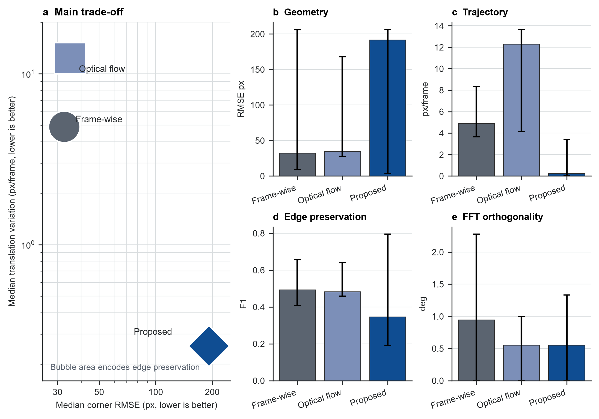
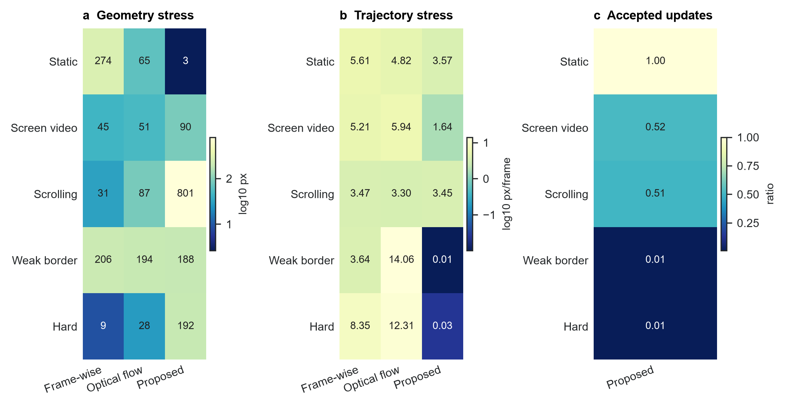
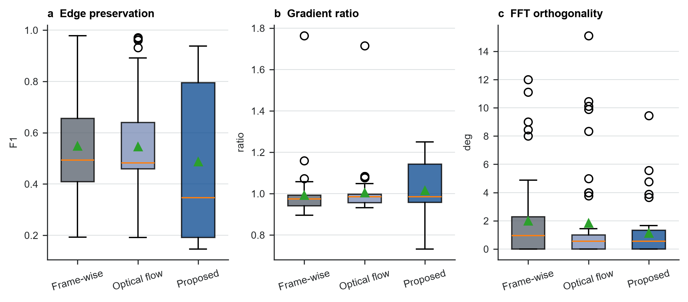
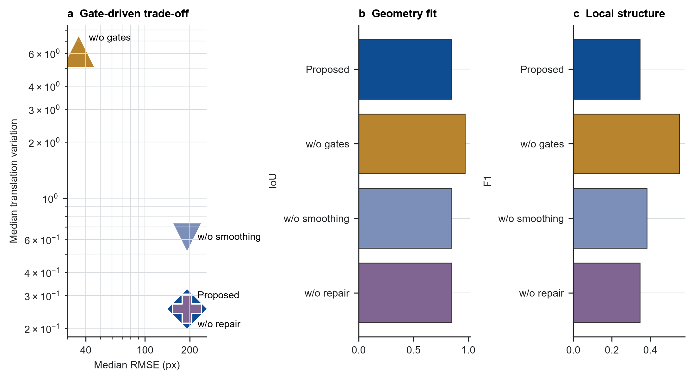
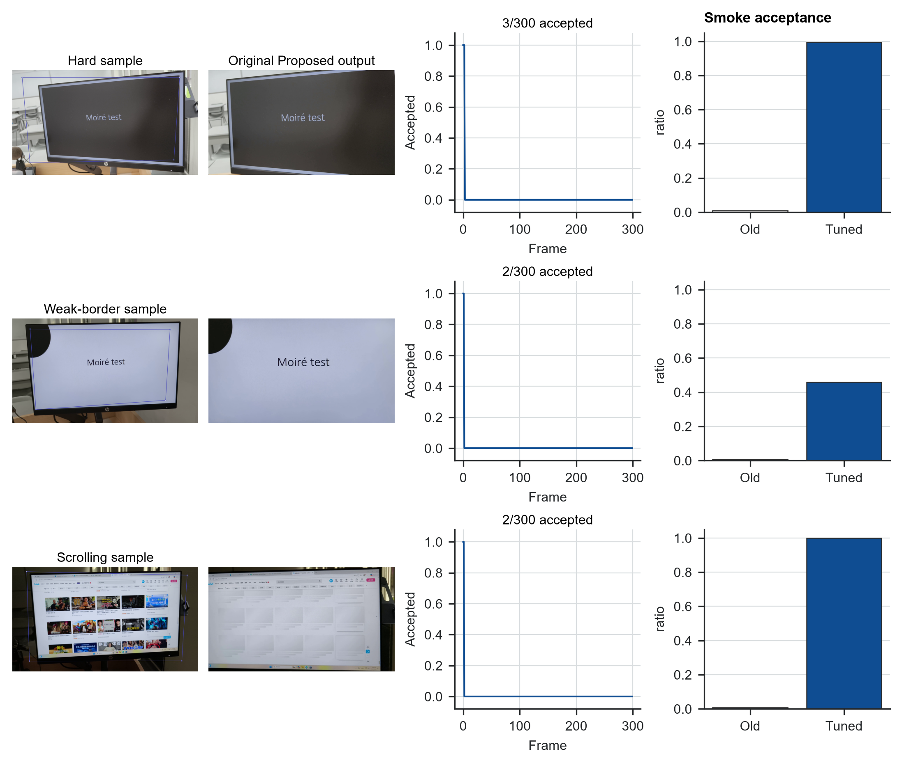

# 摘要

手持拍摄显示器可以在无法直接录屏时保留屏幕内容，但此类视频同时包含透视畸变、相机抖动、背景干扰、弱显示器边框，以及可能独立滚动或播放的屏幕内容。本文实现一套可审计的屏幕平面归一化前端：初始化屏幕四边形，利用金字塔 Lucas--Kanade 特征和 RANSAC 单应矩阵跟踪固定参考平面，通过显式可靠性门控拒绝异常更新，对角点轨迹进行修复和平滑，最后渲染正面屏幕坐标视频。在 50 个真实拍屏视频、14985 帧上的 first-pass benchmark 表明，该方法呈现明确的稳定性-精度取舍。Proposed 的轨迹派生平移变化中位数为 0.254 px/frame，低于 Frame-wise 的 4.886 和 Optical flow 的 12.311；但它没有提升总体标注几何精度，角点 RMSE 中位数为 191.83 px，而两个基线分别为 32.56 px 和 34.88 px，边缘保持指数也更低。分类和消融结果说明主要原因是当前可靠性门控过于保守：它能抑制短时抖动，但在屏幕内部动态内容、弱边界或困难视角主导证据时，会冻结过期或错误几何。一次小样本 post-run tuning smoke test 减轻了 hard 和 weak_border 样本中的过度冻结，但 scrolling 仍需要物理边框证据。本文贡献因此不是完整去摩尔纹系统或全指标最优方法，而是一个可复现、已 benchmark 的几何前端，用于暴露拍屏视频归一化的工程边界。

**关键词：** 屏幕矫正；视频稳定；单应矩阵；光流；拍屏视频；投影几何

# 1. 引言

拍屏视频归一化是后续屏幕内容恢复的几何前提。当直接录屏不可用时，手持相机可以记录演示、软件流程或设备输出，但所得视频并不是干净屏幕录像。它包含周围场景、透视畸变、镜头采样伪影、手持运动、眩光、曝光变化和局部遮挡。若要进一步进行 OCR、内容恢复或去摩尔纹，前端必须先恢复屏幕平面，并把内容表达在稳定的正面屏幕坐标系中。

核心困难在于屏幕内容和物理屏幕并不共享同一个运动模型。屏幕内部纹理可能滚动、动画或播放视频，而物理显示器的运动只来自相机。相邻帧跟踪器可能跟随内部内容而不是屏幕边界；逐帧检测可以避免一部分漂移，但检测噪声会在透视变换后变成输出抖动。本文直接研究这一取舍，而不是用单一视觉质量分数掩盖它。

我们实现一套经典的参考帧锚定屏幕平面归一化流程，并把它作为工程 benchmark 评估。Proposed 方法跟踪固定参考平面，估计鲁棒单应矩阵，只接受可靠更新，修复缺失轨迹段，平滑角点路径，并渲染正面视频。正式实验在 50 个真实拍屏视频上，将该方法与 Frame-wise 和 Optical flow 比较，覆盖 static、screen_video、scrolling、weak_border 和 hard 五类场景。

本文有四个有边界的贡献。第一，建立从完整场景视频和稀疏四角标注到矫正输出、CSV/JSON 指标和逐 clip 审核报告的可复现实验流程。第二，实现带显式更新接受诊断的参考帧锚定跟踪器。第三，在 14985 帧和 179 个非初始化标注帧上报告受控 first-pass 对比。第四，将标注几何、轨迹派生变化、局部细节保持和 FFT 方向诊断拆开报告，避免把平滑误读为正确。

贡献边界同样重要。本文只执行几何归一化和重采样，不是学习式去摩尔纹系统。频域指标描述矫正后的方向规则性，而不是摩尔纹抑制效果。当前实现也没有完成最初 proposal 中最关键的一点：物理显示器边框尚未成为每帧估计的主证据。以下结论只针对已经运行的代码和实验。

# 2. 相关工作

拍屏内容恢复和视频去摩尔纹工作通常假设屏幕区域已经较好裁剪或对齐。Dai 等人构建空间和时间对齐的拍屏/干净视频，并学习关系式时间一致性 [16]；Xu 等人结合方向感知频域处理、对齐、颜色校正和细节恢复 [17]；Yue 等人研究 raw 域屏幕重拍和调制恢复 [18]。这些工作关注内容恢复，本文则处理其前端：从完整手持场景中得到可供恢复模型使用的正面屏幕坐标视频。

平面文档和屏幕矫正依赖同一投影几何基础：透视相机观测到的平面可由单应矩阵映射到正面坐标。文档分析中常使用页面边界、直线、版面和消失点恢复正面文档图像 [1--4]。显示器-相机标定同样把屏幕作为投影平面，但受控投影图案提供了普通手持视频中不存在的强证据 [4]。这些方法支持本文的几何模型，但单图像矫正直接逐帧应用时并不能保证视频连续性。

本文使用的特征跟踪和鲁棒模型估计来自经典视觉方法。Lucas-Kanade 配准 [7] 及其金字塔实现 [8] 支持较大位移下的局部特征跟踪，Shi-Tomasi 特征 [9] 提供可跟踪角点。RANSAC 及其鲁棒估计变体 [10] 用于在错误对应存在时估计单应矩阵。视频稳定研究则表明，应将相机路径平滑、几何畸变和裁剪代价分别评估 [11--14]。本文目标更窄：只稳定物理屏幕平面，目标画布即屏幕矩形，因此没有背景裁剪权衡，但必须处理相机运动和屏幕内容运动之间的歧义。

# 3. 方法

## 3.1 任务定义与流程

任务是在每个视频帧中估计四角屏幕四边形，并将屏幕内容透视变换到固定正面画布。角点顺序固定为左上、右上、右下、左下。系统优先使用人工第 0 帧角点初始化；若没有人工角点，则使用自动轮廓检测。第 0 帧作为初始化证据，不进入几何评分。

Proposed 流程采用参考帧锚定（图 1）。系统在参考屏幕区域内选择 Shi-Tomasi 特征，用金字塔 Lucas-Kanade 光流把这些特征跟踪到新帧，通过前后向误差过滤不一致轨迹，并用剩余对应点估计 RANSAC 单应矩阵。该单应矩阵将参考四边形投影到当前帧，得到候选四边形。

可靠性门控决定候选四边形是否被接受。门控检查匹配点数量、RANSAC 内点数量和比例、中位重投影误差、屏幕平面空间覆盖、面积变化、边长比例和凸性。若候选失败，在线阶段保持上一有效四边形。整段视频处理完成后，系统再用插值、中值滤波和指数平滑修复轨迹。最后，每帧被变换到固定屏幕画布；可选残余对齐只允许主单应之后的小幅仿射校正。

## 3.2 对比方法

三种方法使用相同输入视频、相同第 0 帧初始化角点、相同输出画布、相同编码器、相同标注和相同指标代码。`Frame-wise` 每帧独立估计屏幕四边形，不做时域平滑；`Optical flow` 从上一帧向当前帧传播几何，不使用固定参考锚定；`Proposed` 使用固定参考跟踪、可靠性门控、失败保持、离线插值、中值滤波、指数平滑和残余对齐。

正式 Proposed 配置为 `smooth=0.85`、`median_window=5`、`trajectory_window=9`、`interpolate=true`、`geometry_gate=true`、`reference_align=true`、`reference_reliability_gates=true`。该设置尽量把差异归因于轨迹估计和时域处理，而不是数据、编码或指标实现差异。由于当前系统不做内容恢复，本文不与学习式恢复模型直接比较。

# 4. 数据集与评估协议

## 4.1 数据集

实验使用项目组采集的 50 个视频，共 14985 帧。五类场景各 10 个视频：`hard` 表示困难视角或复杂背景，`screen_video` 表示屏幕内部播放视频，`scrolling` 表示内容滚动，`static` 表示相对静态内容，`weak_border` 表示屏幕边界弱或对比度低。类别和 clip ID 在指标聚合前确定。

每个视频的第 0 帧角点用于初始化，因此不进入几何误差统计。人工标注包含可见屏幕四角，顺序为左上、右上、右下、左下。50 个视频共有 228 个标注帧；排除初始化帧后，45 个视频保留 179 个可匹配标注帧。5 个 `scrolling` 视频只有初始化帧标注，因此几何评估跳过，但仍参与时域、细节和频域评估。

| 类别 | 视频数 | 帧数 |
|---|---:|---:|
| hard | 10 | 3000 |
| screen_video | 10 | 2996 |
| scrolling | 10 | 2995 |
| static | 10 | 2994 |
| weak_border | 10 | 3000 |
| 合计 | 50 | 14985 |

## 4.2 指标

几何精度在非初始化标注帧上计算，包括四角 RMSE、四边形 IoU 和相对宽高比误差。时域稳定性使用估计屏幕四边形的相邻帧投影变化，并分解为平移、旋转和尺度变化。该指标是轨迹派生诊断量，不能单独证明物理稳定性，因为它与方法自身的估计轨迹共享信息。

细节保持在每个视频采样帧上计算梯度幅值比和边缘保持指数，用于描述重采样和对齐对局部结构的影响。频域诊断在固定采样帧上分析 FFT 方向和正交性；该指标只描述几何归一化后的方向规则性，不是去摩尔纹质量分数。所有结果按 clip 聚合后报告中位数和四分位范围，并保留 per-clip CSV 和 JSON 供复核。

运行环境为 Windows 11，Python 3.12.13，OpenCV 5.0.0，NumPy 2.5.1，FFmpeg 8.1。批处理耗时包含算法处理和指标生成，不包含人工标注。

# 5. 结果

## 5.1 端到端运行完成情况

正式 first-pass 实验中，50 个视频全部处理成功；三种方法共产生 150 个矫正视频、600 个指标 JSON 和 50 个 HTML 审核报告。三种方法的总处理时间分别约为 Frame-wise 1111.2 s、Optical flow 1647.9 s、Proposed 1800.3 s；单 clip 中位耗时分别为 22.3 s、32.9 s 和 36.1 s。这说明 first-pass 流程可以端到端跑通，但运行完成本身并不等于输出正确。

## 5.2 主结果是稳定性-精度取舍

总体指标显示的不是 Proposed 全面胜出，而是一个明确取舍（图 3 和表 2）。Proposed 的轨迹派生平移、旋转和尺度变化最低，但在标注几何和边缘保持上低于两个基线。Proposed 的平移变化中位数为 0.254 px/frame，低于 Frame-wise 的 4.886 和 Optical flow 的 12.311；但角点 RMSE 中位数为 191.83 px，高于两个基线的 32.56 px 和 34.88 px。

较低的几何、时域和频域误差更好；边缘保持指数越高越好。因此表 2 支持的是一个窄结论：参考锚定和门控让估计轨迹更平滑，但正式运行不支持总体几何更优的说法。

| 指标 | Frame-wise | Optical flow | Proposed |
|---|---:|---:|---:|
| 角点 RMSE，px ↓ | 32.56 [8.98, 205.83] | 34.88 [27.79, 167.78] | 191.83 [3.56, 206.27] |
| 四边形 IoU ↑ | 0.979 [0.855, 0.991] | 0.973 [0.892, 0.978] | 0.849 [0.810, 0.996] |
| 相对宽高比误差 ↓ | 2.0% [0.3%, 6.2%] | 2.1% [0.8%, 5.6%] | 0.8% [0.1%, 3.2%] |
| 平移变化，px/frame ↓ | 4.886 [3.641, 8.354] | 12.311 [4.136, 13.648] | 0.254 [0.026, 3.411] |
| 旋转变化，deg/frame ↓ | 0.037 | 0.048 | 0.0005 |
| 尺度变化，relative/frame ↓ | 0.0028 | 0.0048 | 0.0001 |
| 梯度幅值比 | 0.974 | 0.984 | 0.985 |
| 边缘保持指数 ↑ | 0.494 [0.409, 0.656] | 0.482 [0.459, 0.640] | 0.347 [0.192, 0.795] |
| FFT 正交误差，deg ↓ | 0.944 [0.000, 2.278] | 0.556 [0.000, 1.000] | 0.556 [0.000, 1.333] |

## 5.3 分类压力揭示取舍出现的位置

分类分析解释了为什么总体结果是混合的（图 4）。Proposed 在 `static` 中表现最好，角点 RMSE 中位数为 2.63 px，低于 Frame-wise 的 274.43 px 和 Optical flow 的 65.41 px。在内容变化较小的场景中，参考锚定能抑制检测抖动，同时不容易被内部内容运动干扰。

同一机制在压力场景中失效。在 `scrolling` 中，Proposed 的 RMSE 中位数达到 801.48 px，而 Frame-wise 和 Optical flow 分别为 31.36 px 和 86.92 px。在 `hard` 和 `weak_border` 中，Proposed 很平滑，但接受更新很少：两个类别的 Proposed 接受帧比例中位数约为 0.01。这说明这些类别中的低时域变化可能来自长期冻结，而不一定是正确跟踪物理屏幕。

## 5.4 定性输出和局部结构诊断

定性输出与指标取舍一致（图 5）。在静态或边界清楚样本中，Proposed 往往能产生稳定正面视图；在滚动、弱边界和困难样本中，它可能裁切屏幕、移动画布，或过长时间保持早期几何。即使轨迹派生变化较低，这些失败仍然可以直接观察到。

细节指标提供了另一个独立检查（图 6）。Proposed 的梯度幅值比中位数为 0.985，接近两个基线；但边缘保持指数中位数只有 0.347，低于 Frame-wise 的 0.494 和 Optical flow 的 0.482。这说明轨迹更平滑并不会自动带来更好的局部边缘一致性，损失可能来自几何误差、冻结后的错位、额外重采样或残余对齐。频域上，Proposed 和 Optical flow 的 FFT 正交误差中位数均为 0.556 deg，低于 Frame-wise 的 0.944 deg；这只说明矫正后主方向更规则，不能解释为去摩尔纹。

## 5.5 消融实验定位可靠性门控

完整消融实验对 50 个视频重复运行。去掉可靠性门控后，几何 RMSE 中位数从 191.83 px 降为 35.63 px，IoU 从 0.849 升至 0.968，但轨迹平移变化从 0.254 px/frame 增至 6.165 px/frame，边缘保持指数也从 0.347 升至 0.552。该结果表明，当前门控过于保守：它显著降低轨迹变化，却牺牲了很多几何贴合和边缘一致性。去掉轨迹平滑后，几何指标基本不变，平移变化增至 0.617 px/frame，说明平滑主要改变时域诊断而非标注帧几何。去掉离线修复在本次主指标中几乎没有变化，说明该模块在 first-pass 实验中未显著触发。

## 5.6 失败模式和 post-run tuning smoke test

人工审核识别出三类代表失败（图 8）。第一，困难视角或遮挡会让早期几何误差被传播；`hard_01` 在正式运行中只接受 3/300 帧。第二，弱边界或低纹理场景导致可靠覆盖不足；`weak_border_10` 只接受 2/300 帧。第三，滚动内容会产生与物理屏幕无关的参考特征；`scrolling_10` 同样只接受 2/300 帧，且没有非初始化几何标注。

一次小样本 post-run tuning smoke test 放松了 dynamic reference gates，并在每类选择 1-2 个样本重跑。该结果不纳入正式 aggregate，但可作为工程诊断。`hard_01` 的接受帧从 3/300 增至 298/300，RMSE 从 191.83 px 降至 41.56 px；`weak_border_10` 的接受帧从 2/300 增至 138/300，RMSE 从 188.20 px 降至 104.78 px。但是 scrolling 仍未解决：`scrolling_05` 虽接受更多更新，但 RMSE 从 873.67 px 恶化到 1027.15 px。这说明放松门控可以减轻过度冻结，但动态内容仍需要物理边框证据，而不是只增加平滑或放松阈值。

# 6. 讨论

本次 first-pass 支持的是 failure-aware 的解释。参考帧锚定、可靠性门控和轨迹平滑能降低估计四边形的短时变化，这在屏幕平面正确时有用；同一设计也可能在 tracker 保持过期几何时产生误导性的稳定。因此，本文把轨迹派生变化、标注几何、边缘保持和定性审核作为分开的证据，而不是合成单一分数。

消融和 tuning smoke test 指向同一改进方向。关闭门控几乎恢复到基线级几何，但损失时域稳定；放松门控可以减轻 hard 和 weak_border 样本中过度冻结，但仍解决不了 scrolling 内容。因此下一步不应只增加平滑，而应改进接受更新的证据来源。最直接路径是完成项目最初提出的物理边框跟踪器：检测屏幕边框线段，估计交点，并把内部特征作为一致性检查，而不是让移动屏幕内容主导单应矩阵。

本实验仍有局限。数据集规模较小且由项目组自采集，不能证明跨设备、显示技术、拍摄距离或光照条件的泛化。几何标注是稀疏关键帧，且部分 scrolling 视频只有初始化帧标注。当前时域指标来自估计轨迹本身，不是独立物理稳定性证据。细节和频域指标没有配对干净录屏，因此不能评估去摩尔纹质量。最后，每次透视变换都会重采样屏幕内容，正面几何和较低抖动可能以模糊、振铃或高频结构变化为代价。

# 7. 结论

本文完成了真实拍屏视频几何归一化项目的一次端到端实验闭环：50 个视频全部跑通，生成三种方法的矫正视频、结构化指标、审核报告、论文图和可复现文档。Proposed 参考帧锚定方法显著降低了轨迹派生变化，但正式 first-pass 运行没有提升总体标注几何或边缘保持。核心发现是保守可靠性门控带来的稳定性-精度取舍。该系统目前最适合作为可审计的几何预处理 benchmark 和后续改进基线。未来应先加入物理边框证据并重跑完整 benchmark，再讨论与去摩尔纹或屏幕内容恢复模型集成。

# 数据可用性

本次论文数值来自正式 first-pass 实验和匹配的完整消融实验。汇总指标表、证据记录和图表源文件随项目提交归档。原始视频为课程项目采集数据，公开发布前需要团队确认隐私和授权边界。

# 代码可用性

代码随项目仓库提供。实验由 `uv` 管理的 Python 脚本运行，提交归档包含论文源文件、导出论文、汇总指标和图表资产。

# 作者贡献

三位作者共同完成项目构思、数据采集、标注、代码实现、实验运行和论文整理。当前仓库记录用于追踪具体代码、文档和实验产物；最终提交版本可根据课程要求进一步细分个人贡献。

# 参考文献

1. L. Jagannathan and C. V. Jawahar, “Perspective Correction Methods for Camera-Based Document Analysis,” 2005.
2. X.-C. Yin, J. Sun, S. Naoi, Y. Fujii, and K. Fujimoto, “Perspective Rectification for Mobile Phone Camera-Based Documents Using a Hybrid Approach to Vanishing Point Detection,” 2007.
3. Williem, C. Simon, S. Cho, and I. K. Park, “Fast and Robust Perspective Rectification of Document Images on a Smartphone,” *CVPR Workshops*, 2014.
4. T. Okatani and K. Deguchi, “Autocalibration of a Projector-Screen-Camera System: Theory and Algorithm for Screen-to-Camera Homography Estimation,” *ICCV*, 2003.
5. R. Grompone von Gioi, J. Jakubowicz, J.-M. Morel, and G. Randall, “LSD: A Line Segment Detector,” *Image Processing On Line*, 2012.
6. J. Lezama, G. Randall, and R. Grompone von Gioi, “Vanishing Point Detection in Urban Scenes Using Point Alignments,” *Image Processing On Line*, 2017.
7. B. D. Lucas and T. Kanade, “An Iterative Image Registration Technique with an Application to Stereo Vision,” 1981.
8. J.-Y. Bouguet, “Pyramidal Implementation of the Lucas Kanade Feature Tracker,” Intel Corporation, 2000.
9. J. Shi and C. Tomasi, “Good Features to Track,” *CVPR*, 1994.
10. P. H. S. Torr and A. Zisserman, “MLESAC: A New Robust Estimator with Application to Estimating Image Geometry,” *Computer Vision and Image Understanding*, 2000.
11. M. Grundmann, V. Kwatra, and I. Essa, “Auto-Directed Video Stabilization with Robust L1 Optimal Camera Paths,” *CVPR*, 2011.
12. J. Sánchez, “Comparison of Motion Smoothing Strategies for Video Stabilization Using Parametric Models,” *Image Processing On Line*, 2017.
13. A. Bradley, J. Klivington, J. Triscari, and R. van der Merwe, “Cinematic-L1 Video Stabilization with a Log-Homography Model,” *WACV*, 2021.
14. W. Guilluy, A. Beghdadi, and L. Oudre, “A Performance Evaluation Framework for Video Stabilization Methods,” *EUVIP*, 2018.
15. B. S. Reddy and B. N. Chatterji, “An FFT-Based Technique for Translation, Rotation, and Scale-Invariant Image Registration,” *IEEE Transactions on Image Processing*, vol. 5, no. 8, 1996.
16. P. Dai, X. Yu, L. Ma, B. Zhang, J. Li, W. Li, J. Shen, and X. Qi, “Video Demoireing with Relation-Based Temporal Consistency,” *CVPR*, 2022.
17. S. Xu, B. Song, X. Chen, and J. Zhou, “Direction-Aware Video Demoireing with Temporal-Guided Bilateral Learning,” *AAAI*, 2024.
18. H. Yue, Y. Cheng, X. Liu, and J. Yang, “Recaptured Raw Screen Image and Video Demoiréing via Channel and Spatial Modulations,” *NeurIPS*, 2023.
