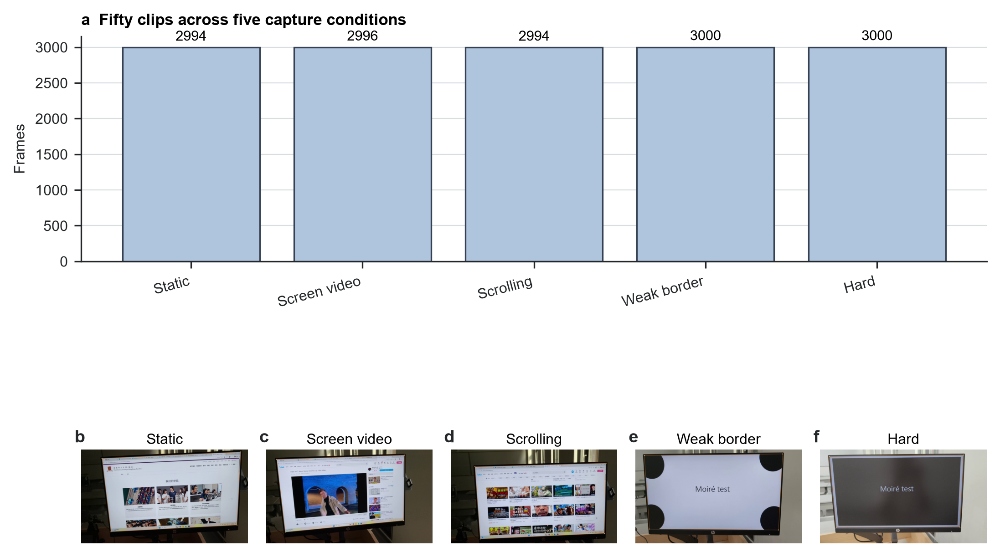
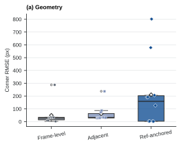
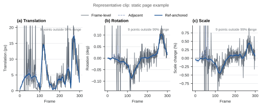

# 摘要

当直接录屏不可用时，拍屏视频可以保留屏幕内容，但同时引入透视畸变、相机抖动、背景干扰、弱显示器边框，以及屏幕内部独立滚动或播放的内容。本文研究这一场景下的几何屏幕平面归一化。我们实现了一套参考帧锚定流程：初始化屏幕四边形，用金字塔 Lucas-Kanade 光流跟踪参考屏幕平面上的稀疏特征，估计 RANSAC 单应矩阵，应用显式可靠性门控，修复并平滑角点轨迹，最后将每帧变换到正面屏幕坐标系。在一个平衡的 10 个真实拍屏视频标注子集上，参考帧锚定方法比逐帧检测和相邻帧跟踪产生更平滑的估计轨迹，平移变化中位数为 2.94 px/frame，低于另外两种方法的 4.29 和 4.91 px/frame。但这种稳定性没有转化为更好的标注几何精度：角点 RMSE 中位数为 158.94 px，而两种较简单方法分别为 30.29 和 32.43 px。消融结果显示，可靠性门控是这一取舍的主要来源：移除门控后，RMSE 中位数降至 35.63 px，但平移变化升至 5.20 px/frame。结果表明，拍屏视频归一化中平滑的屏幕轨迹可能是过期或错误几何，因此必须将时间稳定性和几何正确性分开评估。

**关键词：** 屏幕矫正；视频稳定；单应矩阵；光流；拍屏视频；投影几何

# 1. 引言

拍屏视频常用于课堂、演示、会议和设备输出记录，是无法直接录屏时的实用替代。但与干净录屏不同，手持相机视角包含背景、透视畸变、手部运动、眩光、曝光变化、采样伪影和局部遮挡。后续 OCR、内容恢复或去摩尔纹任务首先需要稳定估计物理显示屏平面。

核心困难在于，显示内容和物理屏幕不服从同一个运动模型。文本、网页和视频可以在屏幕内部运动，而物理显示器的运动只来自相机运动。相邻帧跟踪器可能跟随屏幕内容，而不是屏幕边界；逐帧检测可以避免一部分长期内容漂移，却可能在矫正结果中引入抖动。本文直接评估这一取舍。

我们实现参考帧锚定屏幕平面归一化流程，并与两种简单替代方法比较：逐帧独立检测和相邻帧光流传播。该方法从固定参考屏幕区域跟踪稀疏特征，估计鲁棒单应矩阵，只接受可靠的屏幕平面更新，修复短缺口，平滑轨迹，并渲染正面视频。本文评估范围只包含几何归一化；内容恢复和学习式去摩尔纹不在实验范围内。

本文有三点贡献。第一，定义一个从拍屏视频和四角标注到几何、轨迹指标的可复现实验流程。第二，评估参考帧锚定是否能提升时间稳定性，同时避免把稳定性等同于正确性。第三，通过消融和场景压力分析说明，可靠性门控可以抑制抖动，也可能冻结过期几何。

# 2. 相关工作

拍屏内容恢复和视频去摩尔纹方法通常假设屏幕区域已经被裁剪、对齐，或具有干净参考数据。关系式时间一致性视频去摩尔纹、方向感知视频去摩尔纹和 raw 域重拍屏幕恢复主要关注屏幕区域可用之后的内容恢复 [13-15]。本文处理其前置几何环节：在完整手持场景中估计并稳定显示屏平面。

平面文档和屏幕矫正依赖透视相机和平面之间的投影关系。相机文档分析常利用页面边界、版面线索和投影几何恢复正面文档视图 [1-3]。屏幕-相机标定同样将显示屏建模为平面单应矩阵，但受控标定图案提供了普通手持视频中没有的强证据 [4]。将这类矫正逐帧独立应用，并不能自动获得时间连续性。

本文实现的跟踪器使用经典特征跟踪和鲁棒模型估计。Lucas-Kanade 配准及其金字塔实现支持中等运动下的稀疏特征跟踪 [5,6]，Shi-Tomasi 特征提供可跟踪点 [7]。存在错误对应时，RANSAC 风格鲁棒估计常用于估计几何模型 [8]。视频稳定研究也强调，应分别评估相机路径平滑性和几何畸变 [9-12]。拍屏归一化继承了这种区分，并额外面临移动屏幕内容污染物理屏幕估计的问题。

# 3. 方法

## 3.1 任务与坐标表示

输入是包含一个可见显示屏的手持视频，输出是变换到固定正面屏幕画布的视频。每帧屏幕由四边形表示，角点顺序为左上、右上、右下、左下。第一帧优先使用人工四角标注初始化，缺失时使用自动轮廓检测回退。由于第 0 帧提供初始化证据，它不参与几何误差评分。

## 3.2 参考帧锚定跟踪

该流程从固定参考跟踪物理屏幕平面，而不是把每一帧估计都串接到上一帧（图 1）。系统在初始屏幕区域内选择 Shi-Tomasi 特征，并用金字塔 Lucas-Kanade 光流将其跟踪到后续帧。前后向一致性检查剔除不稳定轨迹。剩余对应点用于 RANSAC 单应矩阵估计，该单应矩阵再把参考四边形投影到当前帧。

## 3.3 可靠性门控与轨迹渲染

只有当候选四边形的支持证据内部一致时，跟踪器才接受更新。门控检查匹配点数量、RANSAC 内点数量和比例、重投影误差、屏幕平面空间覆盖、四边形面积变化、边长比例和凸性。候选失败时，在线轨迹保持上一帧已接受四边形。整段视频处理完成后，轨迹再经过插值修复、中值滤波和指数平滑。最后，每帧被变换到固定屏幕画布，主单应变换后只允许小幅残余仿射对齐。

## 3.4 对比方法

所有对比方法使用相同输入视频、初始化角点、输出画布、标注、编码器和指标代码。第一种替代方法逐帧独立估计屏幕四边形。第二种方法用相邻帧光流传播几何。参考帧锚定方法使用固定参考跟踪、可靠性门控、失败保持、轨迹修复、平滑和残余对齐。具体实现参数保留在可复现材料中，正文只讨论方法机制。

# 4. 数据集与评估

## 4.1 数据集与标注

项目数据集包含 50 个拍屏视频，共 14985 帧。五种拍摄条件各包含十个片段：静态页面、滚动页面、屏幕内播放视频、弱边框场景，以及视角或背景困难的挑战场景。图 2 展示代表性标注帧和用于评估的屏幕角点目标。

人工标注记录可见屏幕四角。当前 50 个视频共有 248 个标注帧；排除初始化帧后，全部 50 个视频都保留非初始化几何标注，共 199 个可评分标注帧。本文更新后的定量比较使用一个平衡的 10 个视频子集，每种拍摄条件选两个片段，共 40 个非初始化标注帧。该子集在滚动页面标注补齐后重新计算主对比和消融的几何、时域指标。

| 拍摄条件 | 数据集片段数 | 正文子集片段数 | 数据集帧数 |
|---|---:|---:|---:|
| 静态页面 | 10 | 2 | 2994 |
| 滚动页面 | 10 | 2 | 2995 |
| 屏幕内播放视频 | 10 | 2 | 2996 |
| 弱边框场景 | 10 | 2 | 3000 |
| 挑战场景 | 10 | 2 | 3000 |
| 合计 | 50 | 10 | 14985 |

## 4.2 指标

几何精度在非初始化标注帧上评估，包括角点均方根误差（RMSE）、四边形交并比（IoU）和相对宽高比误差。时间稳定性由估计屏幕四边形的相邻帧投影变化计算，并总结为平移、旋转和尺度变化。这些时域值是轨迹派生诊断量，不是独立的物理稳定真值。

正文聚焦几何精度和时间稳定性，因为它们直接检验本文的核心取舍。早期细节保持和频域方向诊断继续作为工程记录归档，但不作为本文主要证据。

# 5. 结果

## 5.1 参考帧锚定提升估计平滑性，但没有提升标注几何

主要结果是稳定性-精度取舍。在更新后的 10 个视频子集上，参考帧锚定方法的平移变化中位数最低，但标注几何中位数最差（图 3、表 2）。其平移变化中位数为 2.94 px/frame，低于逐帧检测的 4.29 px/frame 和相邻帧跟踪的 4.91 px/frame。相反，其角点 RMSE 中位数为 158.94 px，高于另外两种方法的 30.29 px 和 32.43 px。

| 指标 | 逐帧检测 | 相邻帧跟踪 | 参考帧锚定 |
|---|---:|---:|---:|
| 角点 RMSE，px ↓ | 30.29 [14.07, 33.40] | 32.43 [29.17, 63.39] | 158.94 [3.47, 202.66] |
| 四边形 IoU ↑ | 0.980 [0.979, 0.988] | 0.978 [0.935, 0.979] | 0.871 [0.826, 0.996] |
| 平移变化，px/frame ↓ | 4.29 [3.41, 5.62] | 4.91 [2.91, 12.31] | 2.94 [0.03, 3.80] |

这一模式说明，更平滑的估计轨迹不一定是更正确的屏幕平面轨迹。当证据较弱或具有误导性时，参考帧锚定方法可能保持一个稳定四边形。保持操作会降低短时变化，也可能保留旧的或错误的几何估计。

## 5.2 取舍依赖场景条件

分类结果显示了取舍的来源（图 4）。在静态页面和屏幕内播放视频场景中，参考帧锚定方法较准确，RMSE 中位数分别为 2.68 px 和 3.12 px。在这些片段中，参考平面相对可靠，内部内容运动没有主导估计。滚动页面则暴露了失败模式，参考帧锚定方法的 RMSE 中位数达到 689.91 px，符合内部内容运动污染参考平面证据的解释。挑战场景同样产生高误差，RMSE 中位数为 191.83 px。

弱边框和挑战场景体现了方法的另一面。在这些条件下，参考帧锚定方法产生了很低的平移变化，中位数分别为 0.017 和 0.026 px/frame。因此，低变化本身不足以证明成功：它可能反映门控拒绝更新后的长期保持。

## 5.3 可靠性门控是主要杠杆

消融实验表明，可靠性门控是观察到的取舍背后的主要机制。移除门控后，角点 RMSE 中位数从 158.94 px 降至 35.63 px，IoU 中位数从 0.871 升至 0.968（表 3）。同时，平移变化中位数从 2.94 px/frame 升至 5.20 px/frame。若门控抑制短时抖动但也阻止跟踪器纠正过期几何，这正是预期方向。

| 变体 | 角点 RMSE，px ↓ | IoU ↑ | 平移变化，px/frame ↓ |
|---|---:|---:|---:|
| 完整参考帧锚定方法 | 158.94 [3.47, 202.66] | 0.871 [0.826, 0.996] | 2.94 [0.03, 3.80] |
| 移除可靠性门控 | 35.63 [3.51, 47.85] | 0.968 [0.962, 0.996] | 5.20 [3.55, 6.16] |
| 移除轨迹平滑 | 158.94 [2.82, 202.66] | 0.871 [0.826, 0.997] | 3.07 [0.09, 3.96] |
| 移除离线修复 | 158.94 [3.47, 202.66] | 0.871 [0.826, 0.996] | 2.94 [0.03, 3.80] |

在这个子集上，轨迹平滑和离线修复消融与完整方法接近。这不证明这些模块在所有条件下都不重要；它只说明，在当前采样片段和指标下，门控决策主导了几何-时域取舍。

## 5.4 可视化样例解释失败模式

定性输出与定量模式一致（图 5）。当被跟踪参考平面与物理屏幕保持一致时，参考帧锚定输出视觉上更稳定。当内部滚动、弱屏幕边界或困难视角主导被跟踪证据时，该方法可能保持偏移或裁切后的屏幕区域。这类结果视觉上稳定，但几何上错误。

# 6. 讨论

实验显示，参考帧锚定对拍屏归一化有用，但并不充分。它通过避免纯相邻帧漂移降低轨迹变化；同一机制也会在已接受四边形过期时产生误导性稳定。这解释了为什么必须分开报告几何精度和时间稳定性。

消融结果表明，更新接受准则是关键设计选择。保守门控有助于抑制抖动，尤其是在弱边框和挑战场景中；但它也可能阻止必要修正。移除门控能恢复相当一部分标注几何精度，代价是更高的时间变化。因此，更强的系统应改进接受更新时使用的证据，例如加入物理屏幕边界线索，使移动屏幕内容不能主导单应矩阵。

本评估有几项边界。数据集规模较小且由项目组自采集，不能证明跨设备、显示技术、拍摄距离或光照条件的泛化。更新后的几何和时域结果来自平衡的 10 个视频子集，还不是完成标注状态下的 50 个视频完整重跑。几何标注是稀疏关键帧，而不是逐帧密集真值。最后，时间指标来自估计四边形本身，因此可以诊断输出平滑性，但不能独立证明物理屏幕平面正确。

# 7. 结论

本文评估了真实拍屏视频的参考帧锚定几何归一化。在更新后的标注子集上，该方法降低了估计轨迹变化，但没有提升标注屏幕几何。消融显示，可靠性门控驱动了这一稳定性-精度取舍：它能抑制抖动，也可能冻结过期几何。主要启示是，拍屏预处理不能把平滑性当作正确性。未来工作应加入更强的物理屏幕平面证据，并在完成标注状态下重跑完整 benchmark。

# 数据可用性

项目包含本地 50 个拍屏视频和配套四角标注。原始视频属于课程项目数据，公开发布前需要团队确认隐私和授权边界。本文使用的汇总指标和证据记录已归档在仓库文档中。

# 代码可用性

代码随项目仓库提供，并通过 `uv` 管理的 Python 脚本运行。仓库包含论文源文件、评估脚本和归档汇总指标，可从可用本地数据复现正文表格。

# 作者贡献

三位作者共同完成项目构思、数据采集、标注、实现、实验运行和论文撰写。

# 参考文献

1. L. Jagannathan and C. V. Jawahar, "Perspective Correction Methods for Camera-Based Document Analysis," 2005.
2. X.-C. Yin, J. Sun, S. Naoi, Y. Fujii, and K. Fujimoto, "Perspective Rectification for Mobile Phone Camera-Based Documents Using a Hybrid Approach to Vanishing Point Detection," 2007.
3. Williem, C. Simon, S. Cho, and I. K. Park, "Fast and Robust Perspective Rectification of Document Images on a Smartphone," *CVPR Workshops*, 2014.
4. T. Okatani and K. Deguchi, "Autocalibration of a Projector-Screen-Camera System: Theory and Algorithm for Screen-to-Camera Homography Estimation," *ICCV*, 2003.
5. B. D. Lucas and T. Kanade, "An Iterative Image Registration Technique with an Application to Stereo Vision," 1981.
6. J.-Y. Bouguet, "Pyramidal Implementation of the Lucas Kanade Feature Tracker," Intel Corporation, 2000.
7. J. Shi and C. Tomasi, "Good Features to Track," *CVPR*, 1994.
8. P. H. S. Torr and A. Zisserman, "MLESAC: A New Robust Estimator with Application to Estimating Image Geometry," *Computer Vision and Image Understanding*, 2000.
9. M. Grundmann, V. Kwatra, and I. Essa, "Auto-Directed Video Stabilization with Robust L1 Optimal Camera Paths," *CVPR*, 2011.
10. J. Sanchez, "Comparison of Motion Smoothing Strategies for Video Stabilization Using Parametric Models," *Image Processing On Line*, 2017.
11. A. Bradley, J. Klivington, J. Triscari, and R. van der Merwe, "Cinematic-L1 Video Stabilization with a Log-Homography Model," *WACV*, 2021.
12. W. Guilluy, A. Beghdadi, and L. Oudre, "A Performance Evaluation Framework for Video Stabilization Methods," *EUVIP*, 2018.
13. P. Dai, X. Yu, L. Ma, B. Zhang, J. Li, W. Li, J. Shen, and X. Qi, "Video Demoireing with Relation-Based Temporal Consistency," *CVPR*, 2022.
14. S. Xu, B. Song, X. Chen, and J. Zhou, "Direction-Aware Video Demoireing with Temporal-Guided Bilateral Learning," *AAAI*, 2024.
15. H. Yue, Y. Cheng, X. Liu, and J. Yang, "Recaptured Raw Screen Image and Video Demoireing via Channel and Spatial Modulations," *NeurIPS*, 2023.
