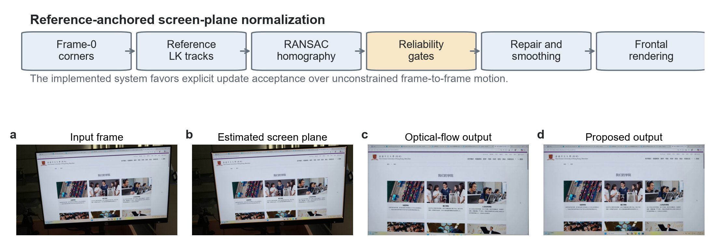
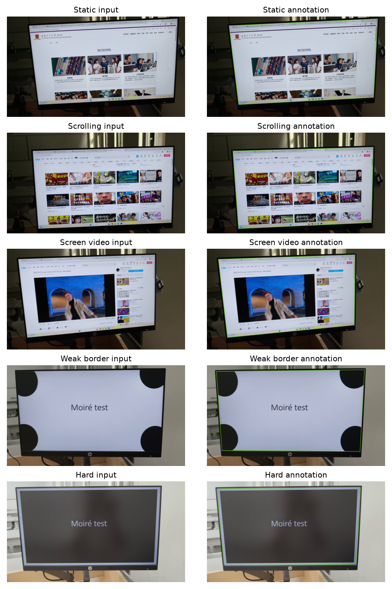
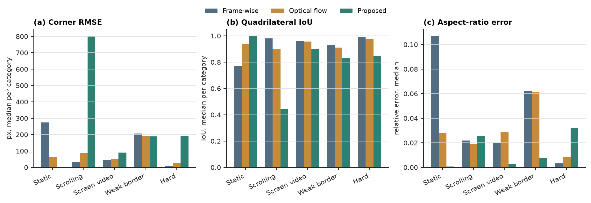
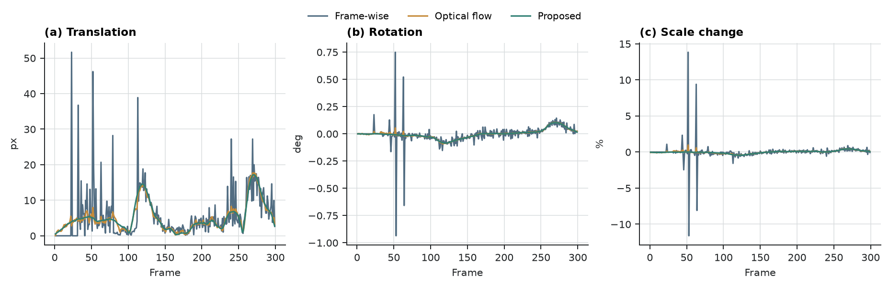
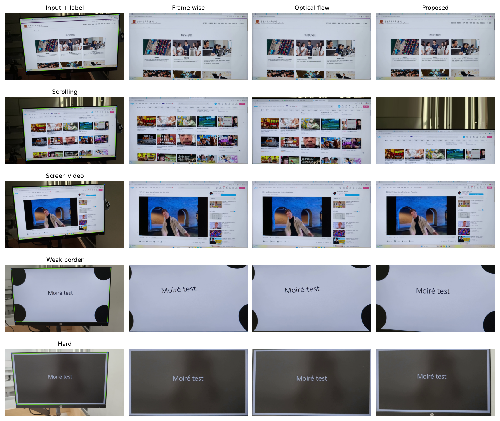
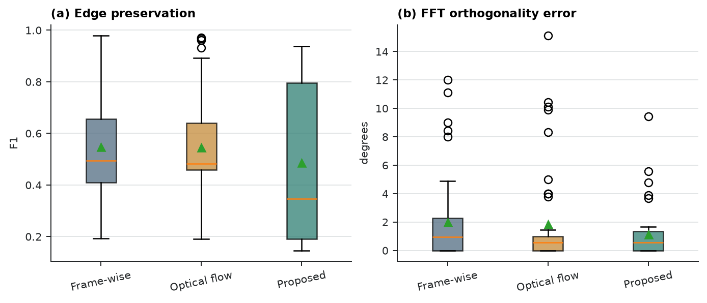
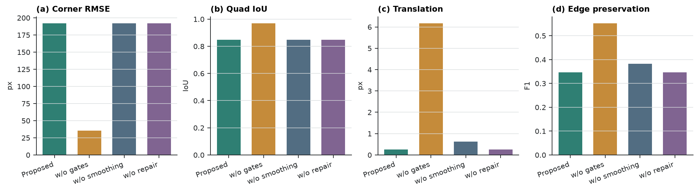
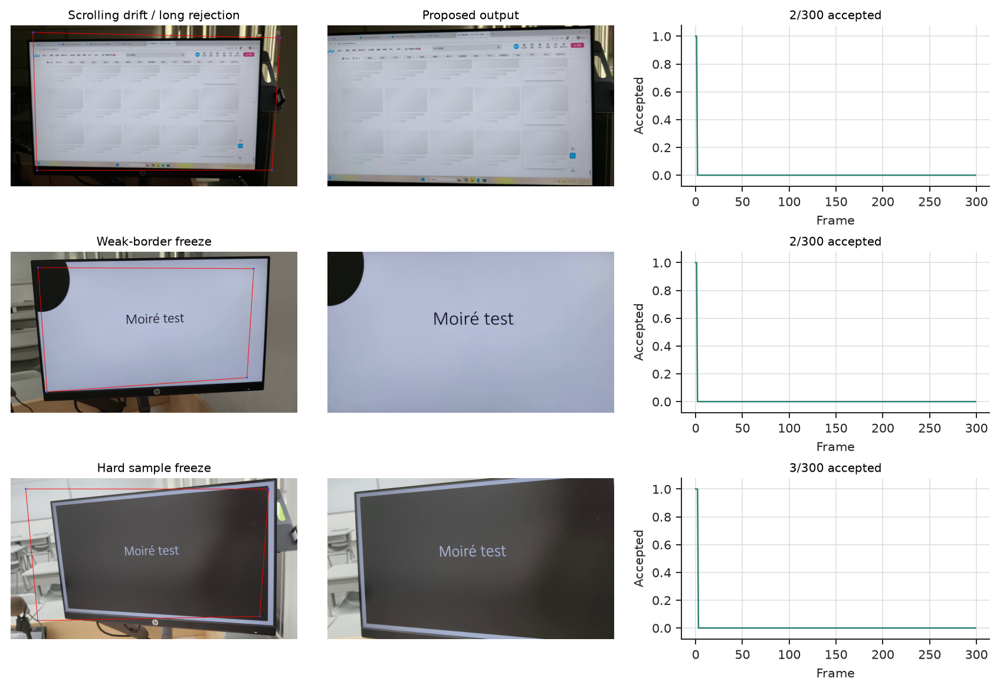

# 摘要

当直接录屏不可用或不合适时，用户常用手持手机拍摄计算机显示器。此类视频同时包含屏幕外背景、透视畸变、手持抖动、弱边框，以及独立滚动或播放的屏幕内容。本文实现并评估一套经典计算机视觉前端：初始化屏幕四边形，利用金字塔 Lucas--Kanade 特征和 RANSAC 单应矩阵相对固定参考帧跟踪屏幕平面，通过可靠性门控拒绝异常更新，对角点轨迹进行修复和平滑，最后渲染正面屏幕坐标视频。实验在 50 个真实拍屏视频、14985 帧上运行，覆盖 hard、screen_video、scrolling、static 和 weak_border 五类场景，并与逐帧检测和相邻帧光流两类基线比较。三种方法均完成全部视频输出。几何评估在排除初始化帧后包含 45 个视频、179 个标注关键帧；Proposed 的角点 RMSE 中位数为 191.83 px，四边形 IoU 中位数为 0.849，相对宽高比误差中位数为 0.8%。对应的 Frame-wise 为 32.56 px、0.979、2.0%，Optical flow 为 34.88 px、0.973、2.1%。Proposed 的轨迹派生平移变化显著更小，中位数为 0.254 px/frame，而两个基线分别为 4.886 和 12.311 px/frame；但其边缘保持指数中位数为 0.347，低于两个基线的 0.494 和 0.482。结果表明，当前参考帧锚定和门控机制可以产生更平滑的估计轨迹，但也会在动态内容、弱边界和长期拒绝更新时冻结或传播错误几何。本文因此将该系统定位为可复现实验前端和后续恢复模型的几何预处理，而不是已经优于全部基线的完整去摩尔纹方法。

**关键词：** 屏幕矫正；视频稳定；单应矩阵；光流；拍屏视频；投影几何

# 1. 引言

手持拍摄显示器是保存演示、记录软件操作或采集无法直接录制设备画面的常见方式。与原生录屏不同，拍屏视频包含显示器周围环境，并受视角、镜头采样、手部运动、眩光、局部遮挡和曝光变化影响。因此，拍屏视频既不是普通自然场景视频，也不是干净屏幕录像。若要进行屏幕内容恢复、去摩尔纹或文字识别，首先需要定位屏幕平面、消除透视畸变，并建立稳定的屏幕坐标系。

该几何前端本身并不简单。屏幕内容可能滚动、播放视频或局部动画，而物理显示器的运动只来自相机。若跟踪全部内部纹理，算法可能将内容运动误认为屏幕运动；若每帧独立检测屏幕，细小检测误差会在输出视频中表现为抖动。本文研究的任务是在完整手持场景视频中估计随时间变化的屏幕四边形，并输出正面、时间上尽量稳定的屏幕视频。

本文的工程贡献包括：

1. 建立从完整视频和稀疏四角标注到矫正视频、结构化指标和逐视频 HTML 审核报告的可复现实验流程；
2. 实现带接受诊断、失败冻结、离线修复和时域平滑的参考帧锚定屏幕平面跟踪方法；
3. 在 50 个真实视频上与逐帧检测和相邻帧光流基线进行受控对比；
4. 将几何精度、轨迹变化、细节保持和频域诊断分开报告，避免把稳定性、清晰度和去摩尔纹混为一个结论。

当前实现不应被解释为去摩尔纹系统。它只执行几何归一化和重采样；傅里叶分析只描述方向规则性和高频结构变化。它也不同于最初 proposal 的完整边框主导跟踪器：当前版本尚未把物理边框线作为每帧运动估计的主要证据。本文所有结论均按已经运行的代码边界表述。

# 2. 相关工作

拍屏内容恢复和视频去摩尔纹工作通常假设屏幕区域已经较好裁剪或对齐。Dai 等人构建空间和时间对齐的拍屏/干净视频，并学习关系式时间一致性 [16]；Xu 等人结合方向感知频域处理、对齐、颜色校正和细节恢复 [17]；Yue 等人研究 raw 域屏幕重拍和调制恢复 [18]。这些工作关注内容恢复，本文则处理其前端：从完整手持场景中得到可供恢复模型使用的正面屏幕坐标视频。

平面文档和屏幕矫正依赖同一投影几何基础：透视相机观测到的平面可由单应矩阵映射到正面坐标。文档分析中常使用页面边界、直线、版面和消失点恢复正面文档图像 [1--4]。显示器-相机标定同样把屏幕作为投影平面，但受控投影图案提供了普通手持视频中不存在的强证据 [4]。这些方法支持本文的几何模型，但单图像矫正直接逐帧应用时并不能保证视频连续性。

本文使用的特征跟踪和鲁棒模型估计来自经典视觉方法。Lucas-Kanade 配准 [7] 及其金字塔实现 [8] 支持较大位移下的局部特征跟踪，Shi-Tomasi 特征 [9] 提供可跟踪角点。RANSAC 及其鲁棒估计变体 [10] 用于在错误对应存在时估计单应矩阵。视频稳定研究则表明，应将相机路径平滑、几何畸变和裁剪代价分别评估 [11--14]。本文目标更窄：只稳定物理屏幕平面，目标画布即屏幕矩形，因此没有背景裁剪权衡，但必须处理相机运动和屏幕内容运动之间的歧义。

# 3. 方法

## 3.1 总体流程

设第 t 帧中的屏幕四边形为四个角点，顺序固定为左上、右上、右下、左下。系统首先用人工第 0 帧角点或自动轮廓检测初始化屏幕平面，然后在参考帧屏幕区域内选择 Shi-Tomasi 特征。对每个新帧，金字塔 LK 光流从参考帧跟踪到当前帧，并通过前后向误差过滤明显不一致的点。保留下来的对应点用于 RANSAC 单应估计，随后将参考四边形投影到当前帧得到候选四边形。

候选更新必须通过多项可靠性检查，包括最小匹配点数、RANSAC 内点数和比例、中位重投影误差、屏幕区域空间覆盖率、四边形面积变化、边长比例和凸性。未通过门控时，在线阶段冻结上一有效四边形；离线阶段再对缺失段插值、用中值窗口抑制离群角点，并用指数平滑降低短时抖动。最后，系统对每帧执行透视变换，将屏幕内容重采样到固定矩形画布。可选残余对齐只允许小幅仿射校正，用于减轻主单应之后的残余运动。

## 3.2 对比方法

本文比较三种方法。Frame-wise 方法每帧独立估计屏幕四边形，不进行时域平滑；它代表检测噪声直接进入输出视频的情况。Optical flow 方法从上一帧向当前帧传播角点或局部特征，不使用固定参考锚定；它代表相邻帧累积跟踪的情况。Proposed 方法使用固定参考跟踪、可靠性门控、失败冻结、离线插值、中值窗口、指数平滑和残余对齐。本次正式运行记录的 Proposed 参数为 `smooth=0.85`、`median_window=5`、`trajectory_window=9`、`interpolate=true`、`geometry_gate=true`、`reference_align=true`、`reference_reliability_gates=true`。

三种方法使用相同输入视频、相同第 0 帧初始化角点、相同输出画布、相同编码器和相同评估代码。这样可以把差异主要归因于轨迹估计和时域处理，而不是数据或指标实现差异。

# 4. 数据集与评估协议

## 4.1 数据集

实验使用 `data/active` 中的 50 个视频，共 14985 帧。五类场景各 10 个视频：`hard` 表示困难视角或复杂背景，`screen_video` 表示屏幕内部播放视频，`scrolling` 表示内容滚动，`static` 表示相对静态内容，`weak_border` 表示屏幕边界弱或对比度低。类别由目录决定，文件名即 clip ID。

每个视频的第 0 帧角点用于初始化，因此不进入几何误差统计。人工标注包含可见屏幕四角，顺序为左上、右上、右下、左下。50 个视频共有 228 个标注帧；排除初始化帧后，45 个视频保留 179 个可匹配标注帧。5 个 `scrolling` 视频只有初始化帧标注，因此几何评估跳过，但仍参与时域、细节和频域评估。

| 类别 | 视频数 | 帧数 |
|---|---:|---:|
| hard | 10 | 3000 |
| screen_video | 10 | 2996 |
| scrolling | 10 | 2995 |
| static | 10 | 2994 |
| weak_border | 10 | 3000 |
| 合计 | 50 | 14985 |

## 4.2 指标

几何精度在非初始化标注帧上计算，包括四角 RMSE、四边形 IoU 和相对宽高比误差。时域稳定性使用估计屏幕四边形的相邻帧投影变化，并分解为平移、旋转和尺度变化。该指标是轨迹派生诊断量，不能单独证明物理稳定性，因为它与方法自身的估计轨迹共享信息。

细节保持在每个视频采样帧上计算梯度幅值比和边缘保持指数，用于描述重采样和对齐对局部结构的影响。频域诊断在固定采样帧上分析 FFT 方向和正交性；该指标只描述几何归一化后的方向规则性，不是去摩尔纹质量分数。所有结果按 clip 聚合后报告中位数和四分位范围，并保留 per-clip CSV 和 JSON 供复核。

运行环境为 Windows 11，Python 3.12.13，OpenCV 5.0.0，NumPy 2.5.1，FFmpeg 8.1。批处理耗时包含算法处理和指标生成，不包含人工标注。

# 5. 结果

## 5.1 运行完成情况

主实验 run `runs/20260714_full_pipeline_first_pass` 中，50 个视频全部处理成功；三种方法共产生 150 个矫正视频、600 个指标 JSON 和 50 个 HTML 审核报告。三种方法的总处理时间分别约为 Frame-wise 1111.2 s、Optical flow 1647.9 s、Proposed 1800.3 s；单 clip 中位耗时分别为 22.3 s、32.9 s 和 36.1 s。

## 5.2 总体指标

表 2 汇总主要指标。较低的几何、时域和频域误差更好；边缘保持指数越高越好。Proposed 在轨迹派生平移、旋转和尺度变化上最稳定，但几何误差和边缘保持不占优。

| 指标 | Frame-wise | Optical flow | Proposed |
|---|---:|---:|---:|
| 角点 RMSE，px ↓ | 32.56 [8.98, 205.83] | 34.88 [27.79, 167.78] | 191.83 [3.56, 206.27] |
| 四边形 IoU ↑ | 0.979 [0.855, 0.991] | 0.973 [0.892, 0.978] | 0.849 [0.810, 0.996] |
| 相对宽高比误差 ↓ | 2.0% [0.3%, 6.2%] | 2.1% [0.8%, 5.6%] | 0.8% [0.1%, 3.2%] |
| 平移变化，px/frame ↓ | 4.886 [3.641, 8.354] | 12.311 [4.136, 13.648] | 0.254 [0.026, 3.411] |
| 旋转变化，deg/frame ↓ | 0.037 | 0.048 | 0.0005 |
| 尺度变化，relative/frame ↓ | 0.0028 | 0.0048 | 0.0001 |
| 梯度幅值比 | 0.974 | 0.984 | 0.985 |
| 边缘保持指数 ↑ | 0.494 [0.409, 0.656] | 0.482 [0.459, 0.640] | 0.347 [0.192, 0.795] |
| FFT 正交误差，deg ↓ | 0.944 [0.000, 2.278] | 0.556 [0.000, 1.000] | 0.556 [0.000, 1.333] |

## 5.3 几何精度

分类结果显示，Proposed 在 `static` 类别上的几何中位误差最低，说明参考锚定和平滑在内容变化较小的场景中有效；但在 `hard`、`screen_video`、`scrolling` 和 `weak_border` 中误差明显增大。尤其是 `scrolling` 的几何中位误差达到 801.48 px，说明内部滚动内容仍会污染当前参考特征或导致长期冻结。Frame-wise 和 Optical flow 的总体几何中位误差相近，且明显低于 Proposed。

这一结果约束了对时域稳定性的解释。Proposed 的轨迹可以更平滑，但若冻结在错误四边形上，平滑本身并不等于几何正确。因此当前版本不能声称在总体几何精度上优于两个基线。

## 5.4 轨迹变化和定性结果

Proposed 的轨迹派生平移变化中位数为 0.254 px/frame，远低于 Frame-wise 的 4.886 和 Optical flow 的 12.311。旋转变化和尺度变化也呈同样趋势。图 4 的 per-category 曲线显示，`hard` 和 `weak_border` 中 Proposed 的轨迹最平滑，而 `scrolling` 仍有明显异常。这与失败图中大量更新被拒绝的情况一致：门控降低了抖动，但可能通过冻结状态隐藏真实相机运动或错误估计。

定性对比进一步说明了这种取舍。静态或边界清晰样本中，Proposed 输出通常更稳定；在滚动内容和困难样本中，输出可能出现裁切、偏移或过度保持旧几何。图 5 展示了按固定协议选取的输入帧和三种方法输出。

## 5.5 细节与频域诊断

Proposed 的梯度幅值比中位数为 0.985，接近两个基线；但边缘保持指数中位数只有 0.347，低于 Frame-wise 的 0.494 和 Optical flow 的 0.482。这说明 Proposed 的稳定和平滑并未自动带来更好的局部边缘一致性，可能由几何误差、冻结后的错位、额外重采样或残余对齐造成。

频域上，Proposed 和 Optical flow 的 FFT 正交误差中位数均为 0.556 deg，低于 Frame-wise 的 0.944 deg；Proposed 的轴对齐误差也较低。该结果只说明矫正后方向更规则，不能解释为去摩尔纹效果。图 6 汇总了细节和频域诊断。

## 5.6 消融实验

完整消融 run `runs/20260714_full_ablation_first_pass` 对 50 个视频重复运行。去掉可靠性门控后，几何 RMSE 中位数从 191.83 px 降为 35.63 px，IoU 从 0.849 升至 0.968，但轨迹平移变化从 0.254 px/frame 增至 6.165 px/frame，边缘保持指数也从 0.347 升至 0.552。该结果表明，当前门控过于保守：它显著降低轨迹变化，却牺牲了很多几何贴合和边缘一致性。去掉轨迹平滑后，几何指标基本不变，平移变化增至 0.617 px/frame，说明平滑主要改变时域诊断而非标注帧几何。去掉离线修复在本次主指标中几乎没有变化，说明该模块在 first-pass run 中未显著触发。

## 5.7 失败案例

人工审核识别出三类代表失败。第一，滚动内容会产生大量与物理屏幕无关的参考特征，使更新被拒绝或错误接受；`scrolling_10` 只接受 2/300 帧。第二，弱边界或低纹理场景导致可用特征覆盖不足，`weak_border_10` 同样只接受 2/300 帧。第三，困难视角和遮挡会让初始或早期几何误差被长期传播，`hard_01` 仅接受 3/300 帧。图 8 将这些输出缺陷与接受帧诊断放在一起。

# 6. 讨论

本次 first-pass 结果没有支持“Proposed 在所有维度优于基线”的强结论。更准确的解释是：参考帧锚定、可靠性门控和轨迹平滑确实能大幅降低估计轨迹的短时变化；但当前门控会频繁冻结轨迹，且在动态内容或弱边界下可能冻结错误几何。因此，时域指标必须和标注几何、边缘保持和定性审核一起解释。

从工程角度看，消融结果最有价值。无可靠性门控的变体几何更贴合标注帧，但时域变化大；完整 Proposed 时域变化小，但几何误差高。这说明下一步优化重点不应只是增加平滑，而应改进“何时接受更新”的证据来源。最直接的方向是完成 proposal 中的物理边框主导跟踪：使用 LSD/Hough 等线段证据估计屏幕边框和交点，用内部特征只做一致性验证，而不是让屏幕内容特征主导单应矩阵。

本实验也有局限。数据集规模较小且由项目组自采集，不能证明跨设备、跨显示技术和跨拍摄距离的泛化。几何标注是稀疏关键帧，且部分 scrolling 视频只有初始化帧，导致该类别几何证据不足。当前时域指标来自估计轨迹本身，不能作为独立物理稳定性证据。细节和频域指标使用参考帧或方向结构作为诊断，没有配对干净录屏，因此不能评估去摩尔纹质量。最后，每次透视变换都会重采样屏幕内容，稳定性和正面几何可能以模糊、振铃或高频结构变化为代价。

# 7. 结论

本文完成了真实拍屏视频几何归一化项目的一次端到端实验闭环：50 个视频全部跑通，生成三种方法的矫正视频、结构化指标、审核报告、论文图和可复现文档。结果显示，当前 Proposed 方法能显著降低轨迹派生的平移、旋转和尺度变化，但没有在总体几何精度和边缘保持上优于基线。该系统目前最适合作为可审计的几何预处理框架和后续改进基线。后续应优先优化可靠性门控和物理边框证据，再讨论与去摩尔纹或屏幕内容恢复模型的集成。

# 数据可用性

本次论文数值来自 `runs/20260714_full_pipeline_first_pass` 和 `runs/20260714_full_ablation_first_pass`。汇总 CSV、Markdown 证据和图表位于 `doc/paper/results/full_pipeline_first_pass`、`doc/paper/results/full_ablation_first_pass`、`doc/paper/evidence/full_pipeline_first_pass_2026-07-14.md` 和 `doc/paper/manuscript/figures`。原始视频为课程项目采集数据，公开发布前需要团队确认隐私和授权边界。

# 代码可用性

代码位于当前仓库分支 `experiment/full-pipeline-first-pass`。实验由 `uv` 管理的 Python 脚本运行，核心证据提交包括 `319b335`（刷新 first-pass evidence）和 `9896cd1`（生成论文图）。本稿生成后会以新的提交记录完整论文源文件和导出文件。

# 作者贡献

三位作者共同完成项目构思、数据采集、标注、代码实现、实验运行和论文整理。当前仓库记录用于追踪具体代码、文档和实验产物；最终提交版本可根据课程要求进一步细分个人贡献。

# 参考文献

1. L. Jagannathan and C. V. Jawahar, “Perspective Correction Methods for Camera-Based Document Analysis,” 2005.
2. X.-C. Yin, J. Sun, S. Naoi, Y. Fujii, and K. Fujimoto, “Perspective Rectification for Mobile Phone Camera-Based Documents Using a Hybrid Approach to Vanishing Point Detection,” 2007.
3. Williem, C. Simon, S. Cho, and I. K. Park, “Fast and Robust Perspective Rectification of Document Images on a Smartphone,” *CVPR Workshops*, 2014.
4. T. Okatani and K. Deguchi, “Autocalibration of a Projector-Screen-Camera System: Theory and Algorithm for Screen-to-Camera Homography Estimation,” *ICCV*, 2003.
5. R. Grompone von Gioi, J. Jakubowicz, J.-M. Morel, and G. Randall, “LSD: A Line Segment Detector,” *Image Processing On Line*, 2012.
6. J. Lezama, G. Randall, and R. Grompone von Gioi, “Vanishing Point Detection in Urban Scenes Using Point Alignments,” *Image Processing On Line*, 2017.
7. B. D. Lucas and T. Kanade, “An Iterative Image Registration Technique with an Application to Stereo Vision,” 1981.
8. J.-Y. Bouguet, “Pyramidal Implementation of the Lucas Kanade Feature Tracker,” Intel Corporation, 2000.
9. J. Shi and C. Tomasi, “Good Features to Track,” *CVPR*, 1994.
10. P. H. S. Torr and A. Zisserman, “MLESAC: A New Robust Estimator with Application to Estimating Image Geometry,” *Computer Vision and Image Understanding*, 2000.
11. M. Grundmann, V. Kwatra, and I. Essa, “Auto-Directed Video Stabilization with Robust L1 Optimal Camera Paths,” *CVPR*, 2011.
12. J. Sánchez, “Comparison of Motion Smoothing Strategies for Video Stabilization Using Parametric Models,” *Image Processing On Line*, 2017.
13. A. Bradley, J. Klivington, J. Triscari, and R. van der Merwe, “Cinematic-L1 Video Stabilization with a Log-Homography Model,” *WACV*, 2021.
14. W. Guilluy, A. Beghdadi, and L. Oudre, “A Performance Evaluation Framework for Video Stabilization Methods,” *EUVIP*, 2018.
15. B. S. Reddy and B. N. Chatterji, “An FFT-Based Technique for Translation, Rotation, and Scale-Invariant Image Registration,” *IEEE Transactions on Image Processing*, vol. 5, no. 8, 1996.
16. P. Dai, X. Yu, L. Ma, B. Zhang, J. Li, W. Li, J. Shen, and X. Qi, “Video Demoireing with Relation-Based Temporal Consistency,” *CVPR*, 2022.
17. S. Xu, B. Song, X. Chen, and J. Zhou, “Direction-Aware Video Demoireing with Temporal-Guided Bilateral Learning,” *AAAI*, 2024.
18. H. Yue, Y. Cheng, X. Liu, and J. Yang, “Recaptured Raw Screen Image and Video Demoiréing via Channel and Spatial Modulations,” *NeurIPS*, 2023.
